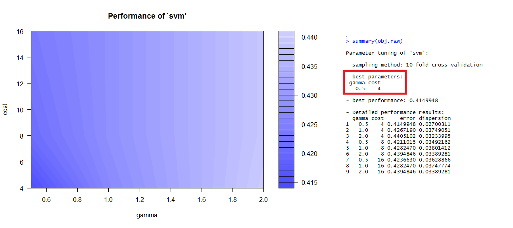
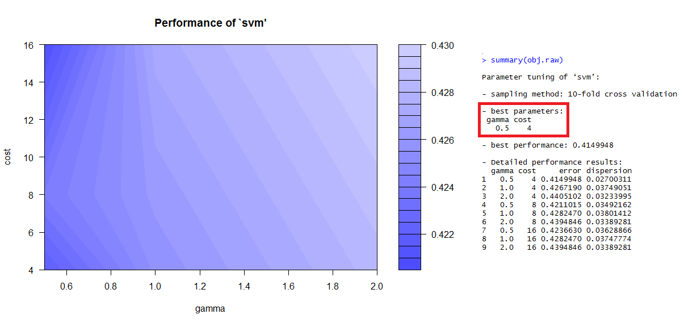
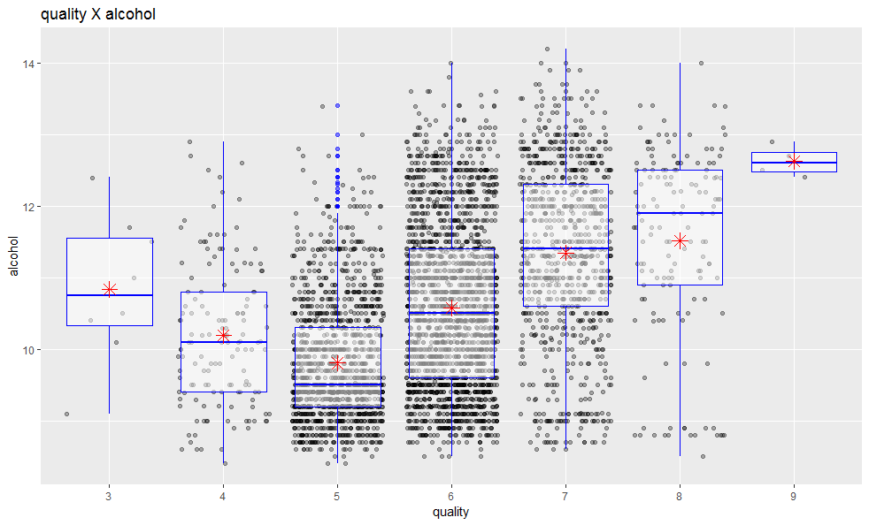
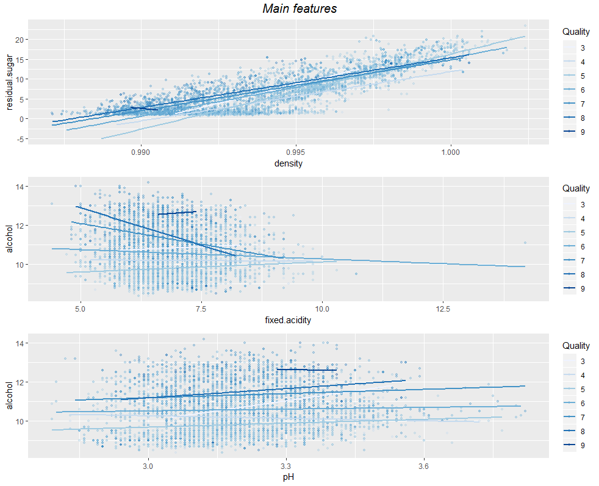

---
output:
  html_document: default
  pdf_document: default
editor_options: 
  chunk_output_type: console
---
TITLE by Rodrigo P Maruyama
========================================================

# Initial Setup


## Libraries 


```r
library(ROCR)
library(ggfortify)
library(ggplot2)
library(knitr)
library(dplyr)
library(GGally)
library(tidyverse)
library(ggthemes)
library(gridExtra)
library(corrplot)
library(grid)
library(lattice)
library(e1071)
library(rpart)
library(randomForest)
library(knitr) 
library(markdown)
library(htmlTable)
```


# Introduction

We will study a white wine dataset with 4898 observations and 12 features. One
of then is the quality of the wine from 0 to 10, and the others are chemical
information. You can find a summary regarding the features in the table below.

Dataset link: [here](https://archive.ics.uci.edu/ml/datasets/wine+quality) <br>
Article link: [here](https://www.semanticscholar.org/paper/Modeling-wine-preferences-by-data-mining-from-Cortez-Cerdeira/977eda794ec436d20b22296ed5f3b4e2f72cb086)

# The Dataset Structure

## Loading Dataset


```r
# Load the Data
wdf <- read.csv('data/wineQualityWhites.csv')
```


## Dataset size


```r
paste('Number of rows in the dataset:', dim(wdf)[1], sep = ' ')
```

```
## [1] "Number of rows in the dataset: 4898"
```


## Summary of the Dataset:


| Feature              | unit                         | Min  | 1st Qu. | Median | Mean   | 3rd Qu. | Max    |
|----------------------|------------------------------|------|---------|--------|--------|---------|--------|
| fixed.acidity        | [g(tartaric acid)/dm^3]      | 3.80 | 6.30    | 6.80   | 6.86   | 7.30    | 14.20  |
| volatile.acidity     | [g(acetic acid)/dm^3]        | 0.08 | 0.21    | 0.26   | 0.28   | 0.32    | 1.10   |
| citric.acid          | [g/dm^3]                     | 0.00 | 0.27    | 0.32   | 0.33   | 0.39    | 1.66   |
| residual.sugar       | [g/dm^3]                     | 0.60 | 1.70    | 5.20   | 6.39   | 9.90    | 65.80  |
| chlorides            | [g(acetic acid)/dm^3]        | 0.01 | 0.04    | 0.04   | 0.05   | 0.05    | 0.35   |
| free.sulfur.dioxide  | [mg/dm^3]                    | 2.00 | 23.00   | 34.00  | 35.31  | 46.00   | 289.00 |
| total.sulfur.dioxide | [g/cm^3]                     | 9.00 | 108.00  | 134.00 | 138.40 | 167.00  | 440.00 |
| density              | [g/cm^3]                     | 0.99 | 0.99    | 0.99   | 0.99   | 1.00    | 1.04   |
| pH                   |                              | 2.72 | 3.09    | 3.18   | 3.19   | 3.28    | 3.82   |
| sulphates            | [g(potassium sulphate)/dm^3] | 0.22 | 0.41    | 0.47   | 0.49   | 0.55    | 1.08   |
| alcohol              | [% vol.]                     | 8.00 | 9.50    | 10.40  | 10.51  | 11.40   | 14.20  |
| quality              |                              | 3.00 | 5.00    | 6.00   | 5.88   | 6.00    | 9.00   |

## Type of Feature


```r
str(wdf)
```

```
## 'data.frame':	4898 obs. of  13 variables:
##  $ X                   : int  1 2 3 4 5 6 7 8 9 10 ...
##  $ fixed.acidity       : num  7 6.3 8.1 7.2 7.2 8.1 6.2 7 6.3 8.1 ...
##  $ volatile.acidity    : num  0.27 0.3 0.28 0.23 0.23 0.28 0.32 0.27 0.3 0.22 ...
##  $ citric.acid         : num  0.36 0.34 0.4 0.32 0.32 0.4 0.16 0.36 0.34 0.43 ...
##  $ residual.sugar      : num  20.7 1.6 6.9 8.5 8.5 6.9 7 20.7 1.6 1.5 ...
##  $ chlorides           : num  0.045 0.049 0.05 0.058 0.058 0.05 0.045 0.045 0.049 0.044 ...
##  $ free.sulfur.dioxide : num  45 14 30 47 47 30 30 45 14 28 ...
##  $ total.sulfur.dioxide: num  170 132 97 186 186 97 136 170 132 129 ...
##  $ density             : num  1.001 0.994 0.995 0.996 0.996 ...
##  $ pH                  : num  3 3.3 3.26 3.19 3.19 3.26 3.18 3 3.3 3.22 ...
##  $ sulphates           : num  0.45 0.49 0.44 0.4 0.4 0.44 0.47 0.45 0.49 0.45 ...
##  $ alcohol             : num  8.8 9.5 10.1 9.9 9.9 10.1 9.6 8.8 9.5 11 ...
##  $ quality             : int  6 6 6 6 6 6 6 6 6 6 ...
```


# Univariate Plots Section

## Histogram for each feature


We can start our observation over the dataset with a histogram for each feature. Looking this graphic we can see that almost all features have a normal distribution and a few of then a right skewed distribution. There some outliers
 that we will discuss and treat then in the next section.

## Removing Outliers


```r
paste('Number of outliers removed:', dim(outliers)[1], sep = ' ')
```

```
## [1] "Number of outliers removed: 233"
```

```r
paste('Number of rows in the new dataset:', dim(wdf.outliers)[1], sep = ' ')
```

```
## [1] "Number of rows in the new dataset: 4698"
```


## Density plot for each feature with stat lines


With this plot I wanted to see how the Mean and the Median are positioned over the distribution and If Median are following the Mean in the positive (right) skewed distribution. As we can see we can confirm this statement for all features except for the "quality".

## Quality.2 feature creation

For a easy understanding about the Wines quality we created a new feature based 
on the quality as you can check in the table below.

| classification | Criterion       |
|----------------|-----------------|
| Bad            | quality < 6     |
| Normal         | quality = 6     |
| Good           | quality > 6     |


And the result, including the number of removed outliers for each classification 
is in the table below.

| Quality.2 | raw  dataset | outliers removed dataset | removed |
|-----------|--------------|--------------------------|---------|
| bad       |     1640     |           1538           |   102   |
| normal    |     2198     |           2143           |    55   |
| good      |     1060     |           1017           |    43   |


In this chart we have a simple but effective visualization about the quality 
distribution fir each classification.

## Univariate Analysis

### What is the structure of your dataset?

See Dataset Structure above.

### What is/are the main feature(s) of interest in your dataset?

The quality is the main feature of interest.

### What other features in the dataset do you think will help support your investigation into your feature(s) of interest?

From [Wine specialists](https://winefolly.com/review/wine-characteristics/) the basics characteristics are:

1. Sweetness
2. Acidity
3. Tannin
4. Alcohol
5. Body

Tannin is correlated with phenolic compounds however we don't have this variable in our dataset, and Body is a mix from all characteristics mentioned above. Then, I will focusing on the following variables:

1. quality
2. pH
3. residual.sugar
4. alcohol

### Did you create any new variables from existing variables in the dataset?

Yes, I created a new variable called quality.2 from quality as in the table below:

 classification |    Criterion
----------------|-----------------
 Bad            |   quality < 6
 Normal         |   quality = 6
 Good           |   quality > 6

### Of the features you investigated, were there any unusual distributions? Did you perform any operations on the data to tidy, adjust, or change the form of the data? If so, why did you do this?

No. I didn't change the original data.

# Bivariate Plots Section

## GGPAIRS plot


```r
ggpairs(wdf.outliers, title = 'GGPAIRS') + 
  theme(panel.grid.minor = element_blank(), panel.grid.major = element_blank(),       axis.line=element_blank(), axis.text=element_blank())
```


With Ggpairs we can have a overview about the correlation for all dataset with
scatter plot, density and correlation number.

## CORRPLOT


```r
cor.wdf.outliers <- cor(wdf.outliers)
corrplot.mixed(cor.wdf.outliers, tl.pos = 'lt', mar=c(2,0,2,0), title = 'CORRPLOT graphic') 
```


Looking at the "ggpairs" and "corrplot" plots result it is easy to have a good idea
about the correlations between the features. In the table below there is a list with a few pairs with a positive, negative and zero correlation. The positive correlation
have 4 rows but we will discharge the number 2 because those features have similar
properties.

## Positive, Negative and Zero Correlation Table

|    | Positive correlation                       | correlation |
|----|--------------------------------------------|-------------|
| 1  | density x residual.sugar                   |    0.84     |
| 2  | total.sulfur.dioxide x free.sulfur.dioxide |    0.61     |
| 3  | density x total.sulfur.dioxide             |    0.55     |
| 4  | quality x alcohol                          |    0.42     |

|    | Negative correlation                       | correlation |
|----|--------------------------------------------|-------------|
| 1  | density x alcohol                          |   -0.81     |
| 2  | alcohol x residual.sugar                   |   -0.48     |
| 3  | total.sulfur.dioxide x alcohol             |   -0.46     |

|    | Zero correlation                           | correlation |
|----|--------------------------------------------|-------------|
| 1  | quality x citric.acid                      |    0.02     |
| 2  | sulphates x chlorides                      |    0.07     |
| 3  | density x volatily.acidity                 |    0.02     |

## Bivariate Boxplots


We can observe a very clear tendency for good wines to have a different behavior 
from the others.For example, in the 3rd plot (quality x alcohol) the good wines
have a level of alcohol around 12 % volume, what means around 1% higher than the 
others as you can see below:


```r
paste('good:', mean.good, 
  '% / normal:', mean.normal, 
  '% / bad:', mean.bad, '%', 
  sep = ' ')
```

```
## [1] "good: 12.62 % / normal: 11.51 % / bad: 10.48 %"
```


We can verify in the 1st plot that higher levels of density means low level of
alcohol what it is expected once water is denser than alcohol.


We can notice that we have much more outliers and a flat behavior for the 
features with zero correlation than the positive and negative ones.

## Bivariate Scatter plots with linear regression line


It is very clear to notice with the linear regression lines the positive correlation
beteween those features once the x variable increase as the y variable increase too.


Similar to the positive correlation, here it is clear again the negative
correlation looking  for the linear regression lines.


In this graphic it is interesting the 2nd plot where we have a very clear cluster 
on the left side and some points spread out on the right side. This can be a 
motivation to look into those ones carefully.

## Bivariate Analysis

### Talk about some of the relationships you observed in this part of the investigation. How did the feature(s) of interest vary with other features in the dataset?

- Strong Positive correlation

In the density_X_residual.sugar plot we can observe a strong correlation. The
amount of wines with lower density and residual.sugar is bigger than high values.
In density_X_total.sulfur.dioxide the plot have a eclipse format where the amount
of wines have a concentration in the midle for both features but fot total.sulfur.dioxide they are spread much more.


- Strong Negative correlation

In the density_X_alcohol plot we can see the expected behavior once the alcohol
density is lower than the water density.
For both second and third plots they have a negative tendency nad for alcohol_X_residual.sugar they are a concentration of wines with lower residual.sugar quantities.

- Zero Correlation

Those plots we can check what was expected from the correlation value. They don't
have any strong tendency.

### Did you observe any interesting relationships between the other features (not the main feature(s) of interest)?

No.

### What was the strongest relationship you found?

|    | Positive correlation                       | correlation |
|----|--------------------------------------------|-------------|
| 1  | density x residual.sugar                   |    0.84     |
| 2  | total.sulfur.dioxide x free.sulfur.dioxide |    0.61     |
| 3  | density x total.sulfur.dioxide             |    0.55     |
| 4  | quality x alcohol                          |    0.42     |

In this table we can see the correlation using a raw dataset and the dataset
without oultliers we can't see difference between them. We can disconsidering
total.sulfur.dioxide x free.sulfur.dioxide beacuse one is part of the others.

# Multivariate Plots Section

## Highest Correlated features plots


## Multivariate Analysis

### Talk about some of the relationships you observed in this part of the investigation. Were there features that strengthened each other in terms of looking at your feature(s) of interest?

We can confirm the correlation between density and residual.sugar in the ggpairs
 plot and linear regression line over the previous one. I all of the 4
 multivariate graphics we can observe a concentration for good wines instead
 normal and bad ones.

# Machine Learning Models

## Creating Training and Test Datasets for Raw Data


```r
# Loading wdf.raw dataset
wdf.raw <- wdf
wdf.raw$X <- NULL
wdf.raw$quality <- as.factor(wdf$quality)

# Creating train.raw and test.raw datasets
set.seed(13)
samp <- sample(nrow(wdf.raw), 0.4 * nrow(wdf.raw))
train.raw <- wdf.raw[samp, ]
test.raw <- wdf.raw[-samp, ]
```

## Creating Training and Test Datasets for Outliers


```r
wdf.outliers$quality <- as.factor(wdf.outliers$quality)

# Creating Train.outliers and Test.outliers datasets
set.seed(13)
samp <- sample(nrow(wdf.outliers), 0.4 * nrow(wdf.outliers))
train.outliers <- wdf.outliers[samp, ]
test.outliers <- wdf.outliers[-samp, ]
```


## Random Forest Model


```r
# Random Forest Raw
a <- 0
while (a < 10){
  a <- a + 1
  model <- randomForest(quality ~ . - quality, data = train.raw)
  rf.pred <- predict(model, newdata = test.raw)
  acc.rf <- classAgreement(table(rf.pred, test.raw$quality))[1]
  time <- Sys.time() 
  str <- paste('rf', time, as.numeric(acc.rf), sep = ',')
  write(str, file = 'data/accuracy_models.csv', append = TRUE)
}

# Random Forest Raw
a <- 0
while (a < 10){
  a <- a + 1
  model <- randomForest(quality ~ . - quality, data = train.outliers)
  rf.pred <- predict(model, newdata = test.outliers)
  acc.rf <- classAgreement(table(rf.pred, test.outliers$quality))[1]
  time <- Sys.time() 
  str <- paste('rf.out', time, as.numeric(acc.rf), sep = ',')
  write(str, file = 'data/accuracy_models.csv', append = TRUE)
}
```


## Tuning the parameters SVM


```r
# Tune with raw dataset
obj.raw <- tune.svm(quality~., data = train.raw, gamma = 2^(-1:1),
  cost = 2^(2:4))
summary(obj.raw)
p.tune.svm.raw <- (plot(obj.raw))

# tune with outliers dataset
obj.outliers <- tune.svm(quality~., data = train.outliers, gamma = 2^(-1:1),
  cost = 2^(2:4))
summary(obj.outliers)
p.tune.svm.outliers <- (plot(obj.outliers))
```

 



## Supported Vector Machines


```r
# SVM raw
df.list <- list(data.frame(train.raw), data.frame(test.raw))
a <- 0
while (a < 10){
  a <- a + 1
  svm.model  <- svm(quality ~ ., data = train.raw, cost = 4, gamma = 1)
  svm.pred <- predict(svm.model,test.raw[,-12])
  acc.svm <- classAgreement(table(svm.pred, test.raw$quality))[1]
  time <- Sys.time() 
  str <- paste('svm', time, as.numeric(acc.svm), sep = ',')
  write(str, file = 'data/accuracy_models.csv', append = TRUE)
}

# SVM outliers
df.list <- list(data.frame(train.outliers), data.frame(test.outliers))
a <- 0
while (a < 10){
  a <- a + 1
  svm.model  <- svm(quality ~ ., data = train.outliers, cost = 4, gamma = 1)
  svm.pred <- predict(svm.model,test.outliers[,-12])
  acc.svm <- classAgreement(table(svm.pred, test.outliers$quality))[1]
  time <- Sys.time() 
  str <- paste('svm.out', time, as.numeric(acc.svm), sep = ',')
  write(str, file = 'data/accuracy_models.csv', append = TRUE)
}
```

## Rpart


```r
# rpart raw
a <- 0
while (a < 10){
  a <- a + 1
  rpart.model <- rpart(quality ~ ., data = train.raw)
  rpart.pred <- predict(rpart.model, test.raw[,-12], type = 'class')
  table(rpart.pred,test.raw[,12])
  classAgreement(table(pred = rpart.pred,true = test.raw[,12]))
  acc.rpart <- classAgreement(table(rpart.pred, test.raw$quality))[1]
  time <- Sys.time() 
  str <- paste('rpart', time, as.numeric(acc.rpart), sep = ',')
  write(str, file = 'data/accuracy_models.csv', append = TRUE)
}

# rpart outliers
a <- 0
while (a < 10){
  a <- a + 1
  rpart.model <- rpart(quality ~ ., data = train.outliers)
  rpart.pred <- predict(rpart.model, test.outliers[,-12], type = 'class')
  table(rpart.pred,test.outliers[,12])
  classAgreement(table(pred = rpart.pred,true = test.outliers[,12]))
  acc.rpart <- classAgreement(table(rpart.pred, test.outliers$quality))[1]
  time <- Sys.time() 
  str <- paste('rpart.out', time, as.numeric(acc.rpart), sep = ',')
  write(str, file = 'data/accuracy_models.csv', append = TRUE)
}
```

## The Accuracy average for each Model


```r
htmlTable(acc.matrix,
          css.cell = ("padding-left: 1em; padding-right: 1em;"), 
          header =  c('Random Forest', 'SVM', 'Rpart'),
          rnames = c('RAW Data', 'Outliers Data'),
          caption="Accuracy Mean (%)")
```

```
## Error in htmlTable(acc.matrix, css.cell = ("padding-left: 1em; padding-right: 1em;"), : object 'acc.matrix' not found
```


## Pricipal component analysis - PCA

To better understand how the features are correlated I ran a PCA algorithm and
I did the plot for the PCA Components and a graphic with Variance x Number of
Component to decide how many Components I will use in the following models.


```r
# PCA
wdf.pca <- prcomp(wdf.outliers[,1:11], center = TRUE, scale. = TRUE)
```


### Variance x Number of components


Looking at this graphic it is easy to indentify that we can run the models with
8 components without loosing accuracy in our model.

### Correlation between features


In this graphic we can confirm some teories about the correlation between the
variables. For example we expect negative correlation with alcohol and residual.sugar
once the alcohol needs sugar to be produced. pH and citric.acid and fixed.acidity
also need to have negative correlation once the lowest pH means very acid solution.

## New PCA Datasets


```r
# New dataframe
new.wdf.pca <- data.frame(wdf.pca$x)
new.wdf.pca <- data.frame(new.wdf.pca[,1:8], quality = wdf.outliers$quality)

# Creating train and test datasets
set.seed(123)
samp <- sample(nrow(new.wdf.pca), 0.8 * nrow(new.wdf.pca))
new.train.pca <- new.wdf.pca[samp, ]
new.test.pca <- new.wdf.pca[-samp, ]
```

## Random Forest Model after PCA


```r
# Random Forest Raw
a <- 0
while (a < 10){
  a <- a + 1
  model <- randomForest(quality ~ . - quality, data = new.train.pca)
  rf.pred <- predict(model, newdata = new.test.pca[, -9])
  acc.rf <- classAgreement(table(rf.pred, new.test.pca$quality))[1]
  time <- Sys.time() 
  str <- paste('rf', time, as.numeric(acc.rf), sep = ',')
  write(str, file = 'data/accuracy_models_pca.csv', append = TRUE)
}
```

## Mean Random Forest Accuracy


```r
htmlTable(mean.acc.rf,
          css.cell = ("padding-left: 1em; padding-right: 1em;"), 
          header =  c('Random Forest'),
          rnames = c('Outliers Data'),
          caption="Accuracy Mean (%)")
```

<table class='gmisc_table' style='border-collapse: collapse; margin-top: 1em; margin-bottom: 1em;' >
<thead>
<tr><td colspan='2' style='text-align: left;'>
Accuracy Mean (%)</td></tr>
<tr>
<th style='border-bottom: 1px solid grey; border-top: 2px solid grey;'> </th>
<th style='border-bottom: 1px solid grey; border-top: 2px solid grey; text-align: center;'>Random Forest</th>
</tr>
</thead>
<tbody>
<tr>
<td style='border-bottom: 2px solid grey; text-align: left;'>Outliers Data</td>
<td style='padding-left: 1em; padding-right: 1em; border-bottom: 2px solid grey; text-align: center;'>69.11</td>
</tr>
</tbody>
</table>

We could increase the accuracy in more than 4% with Random Forest and PCA.

# Final Plots and Summary

## Plot One


### Description One

THe PCA component plot is a very ilustrative way to see the correlation between the features. As we expected quality is very negative correlated with residual.sugar as pH and Acidty as well.

## Plot Two




### Description Two

In this Graphic we can see that the Very Good wines (quality = 9) have a very low variance. If we look the Median lines for each class (Good, Normal, Bad) we can see that the main Wine Qualities are 5, 6 and 7 because those lines are matching with their respective Medians. This is just another way we saw in the Density graphics where we plot the Mean and Median over the distribution for each feature. 


## Plot Three




### Description Three

In this plot, I want to see the correlations I expected observe following the 
wine specialists, acidity, sweetness and alcohol. However, we can see a very 
strong correlation between sweetness and density. For the other 2 characteristics, 
the points are very spread out.

------

# Reflection

  First I tried to remove outliers just with a observation over the univariate 
plots. After that, I used the statistical method from the difference between the 
1st and 3rd quartile multiplied by 1.5 what shows up much more efficient looking 
the accuracy we got in the Predictors.
  I wanted to try to predict the quality using the tannin characteristic 
however we don't have this feature in this data set.
  The Predictors performed well and as we expected the dataset with PCA got an 
accuracy score higher than the original dataset.
  I didn't create any new feature from the original dataset what can be the next 
approach for the future analysis.
  
  
# General resources

## Articles

- Modeling wine preferences by data mining from physicochemical properties by Paulo Cortez,Ant?nio Cerdeira, Fernando Almeida, Telmo Matos, Jos? Reis. (2009) 547-553 <br>
- Support Vector Machines, The Interface to libsvm in package e1071 by David Meyer <br>
- A Practical Guide to Support Vector Classification by Chih-Wei Hsu, Chih-Chung Chang, and Chih-Jen Lin (2016)

## R
Remove the column X from Dataframe:  https://stackoverflow.com/questions/6286313/remove-an-entire-column-from-a-data-frame-in-r/30620946 <br>
Write function: https://stat.ethz.ch/R-manual/R-devel/library/base/html/write.html <br>
Get current Date and Time: https://stat.ethz.ch/R-manual/R-devel/library/base/html/Sys.time.html <br>
Concatenate Strings: https://stat.ethz.ch/R-manual/R-devel/library/base/html/paste.html <br>
Format function: https://www.rdocumentation.org/packages/base/versions/3.5.1/topics/format <br>
htmlTable: https://cran.r-project.org/web/packages/htmlTable/vignettes/tables.html <br>
ROCR: https://cran.r-project.org/web/packages/ROCR/ROCR.pdf <br>
anti_join: https://stackoverflow.com/questions/38085288/how-to-subtract-one-dataframe-from-another

## Style and Markdown tools and cheatsheet

Marktable generator: https://www.tablesgenerator.com/markdown_tables <br>
markdown table formater: http://markdowntable.com/ <br>
Markdown basics: https://rmarkdown.rstudio.com/authoring_basics.html <br>
Style guide: http://adv-r.had.co.nz/Style.html <br>
Histogram colors: https://www.r-bloggers.com/how-to-make-a-histogram-with-ggplot2/ <br>

## Wine related articles
Sulfite regulation USA: https://www.ecfr.gov/cgi-bin/text-idx?c=ecfr&sid=33fc0c0194b58b6fe95208945b5c637a&rgn=div5&view=text&node=27:1.0.1.1.2&idno=27 <br>
Wine Characteristics: https://winefolly.com/review/wine-characteristics/ <br>

## GGplot, GGPAIRS, Corrplot and other Visualizations tips and tricks
Colors in ggplot: http://www.cookbook-r.com/Graphs/Colors_(ggplot2)/ <br>
More COlors in ggplot: http://www.sthda.com/english/wiki/ggplot2-colors-how-to-change-colors-automatically-and-manually <br>
Insert a line in plot: http://www.sthda.com/english/wiki/abline-r-function-an-easy-way-to-add-straight-lines-to-a-plot-using-r-software <br>
Corrplot: https://cran.r-project.org/web/packages/corrplot/vignettes/corrplot-intro.html <br>
aes_string in the geom_vline: https://www.biostars.org/p/234142/ <br>
Pie color reference link: http://www.r-tutor.com/elementary-statistics/qualitative-data/pie-chart <br>
Legend and percent reference link: https://www.tutorialspoint.com/r/r_pie_charts.htm <br>
GGpairs: https://www.rdocumentation.org/packages/GGally/versions/1.4.0/topics/ggpairs <br>
Ggpairs with background: https://stackoverflow.com/questions/48104455/ggpairs-correlation-values-without-gridlines <br>
ggbipplot documentation: https://www.rdocumentation.org/packages/ggbiplot/versions/0.55 <br>

## PCA and Machine Learning Models
PCA: https://www.r-bloggers.com/computing-and-visualizing-pca-in-r/ <br>
Random Forest Predictor: https://datascienceplus.com/predicting-wine-quality-using-random-forests/ <br>
Random Forest + PCA: https://www.analyticsvidhya.com/blog/2016/03/practical-guide-principal-component-analysis-python/ <br>
