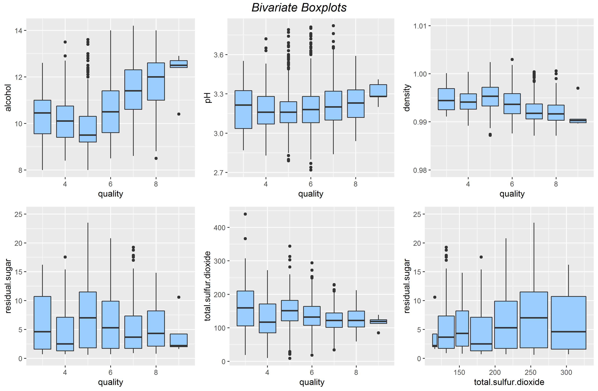
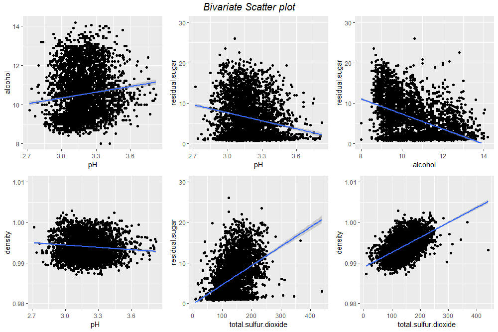

TITLE by Rodrigo P Maruyama
========================================================
# Table of contents

1. Data Structure: 
  + Features names
  + Size
  + Summary (mean, median, 1st and 3rd quantile, min and max values)

2. Univariate Plots Section
  + Histogram plot for each variable
  + Density plot for each variable
  + Quality histogram in detail
  + Quality.2 feature creation
  + Univariate analysis

3. Bivariate Plots Section
  + ggpairs plot
  + corrplot
  + Highest correlation pairs Table
  + Bivariate Boxplots
  + Bivariate Scatter plots with linear regression line
  + Bivariate analysis

4. Multivariate Plots Section
  + Highest Correlated features plots
  + Special Scatter plot with linear regression line
  + Multivariate analysis

5. Pricipal component analysis - PCA

6. Models 
  + Random Forest model
  + Random Forest model with PCA
  + SVM
  
7. Final Plots and Summary

8. Reflection

9. Resources

```{r echo=FALSE, message=FALSE, warning=FALSE, setting the working directory}
setwd("C:/Users/maru/Documents/dsNanodegree/machine-learning-master/projects/finding_donors/dataAnalysisR/project/")
```


```{r echo=FALSE, message=FALSE, warning=FALSE, packages}
# Load all of the packages that you end up using in your analysis in this code
# chunk.

# Notice that the parameter "echo" was set to FALSE for this code chunk. This
# prevents the code from displaying in the knitted HTML output. You should set
# echo=FALSE for all code chunks in your file, unless it makes sense for your
# report to show the code that generated a particular plot.

# The other parameters for "message" and "warning" should also be set to FALSE
# for other code chunks once you have verified that each plot comes out as you
# want it to. This will clean up the flow of your report.
#install.packages("ggplot2", dependencies = TRUE) 
#install.packages("knitr", dependencies = TRUE)
#install.packages("dplyr", dependencies = TRUE)
#install.packages('GGally', dependencies = TRUE)
#install.packages('tidyverse', dependencies = TRUE)
#install.packages('ggthemes', dependencies = TRUE)
#install.packages('corrplot', dependencies = TRUE)
#install.packages('ggbiplot, dependencies = TRUE)
install.packages('kernlab', dependencies = TRUE)
install.packages('caret', dependencies = TRUE)
library(ggplot2)
library(knitr)
library(dplyr)
library(GGally)
library(tidyverse)
library(ggthemes)
library(gridExtra)
library(corrplot)
library(grid)
library(lattice)
library(ggbiplot)
library(kernlab)
library(caret)
```

```{r echo=FALSE, Load_the_Data}
# Load the Data
wdf <- read.csv('data/wineQualityWhites.csv')
wdf$X <- NULL
```
Remove the column X from Dataframe:  https://stackoverflow.com/questions/6286313/remove-an-entire-column-from-a-data-frame-in-r/30620946

# The Dataset Structure

```{r echo=TRUE}
names(wdf)
```

## Features names

|fixed.acidity|volatile.acidity|citric.acid|residual.sugar|
|chlorides|free.sulfur.dioxide|total.sulfur.dioxide|density|
|pH|sulphates|alcohol|quality|

```{r echo=TRUE}
dim(wdf)
```

## Dataset size

[1] 4898   12

### Summary of the Dataset:

```{r echo=TRUE}
swdf <- summary(wdf)
swdf <- data.frame(val = unclass(swdf$coefficients))
swdf <- t.data.frame(swdf)
write.csv(swdf, file = 'summary.csv')

# The markdown table was generated from the csv file by  https://www.tablesgenerator.com/markdown_tables

```


| Feature              | unit                         | Min  | 1st Qu. | Median | Mean   | 2nd Qu. | Max    |
|----------------------|------------------------------|------|---------|--------|--------|---------|--------|
| fixed.acidity        | [g(tartaric acid)/dm^3]      | 3.80 | 6.30    | 6.80   | 6.86   | 7.30    | 14.20  |
| volatile.acidity     | [g(acetic acid)/dm^3]        | 0.08 | 0.21    | 0.26   | 0.28   | 0.32    | 1.10   |
| citric.acid          | [g/dm^3]                     | 0.00 | 0.27    | 0.32   | 0.33   | 0.39    | 1.66   |
| residual.sugar       | [g/dm^3]                     | 0.60 | 1.70    | 5.20   | 6.39   | 9.90    | 65.80  |
| chlorides            | [g(acetic acid)/dm^3]        | 0.01 | 0.04    | 0.04   | 0.05   | 0.05    | 0.35   |
| free.sulfur.dioxide  | [mg/dm^3]                    | 2.00 | 23.00   | 34.00  | 35.31  | 46.00   | 289.00 |
| total.sulfur.dioxide | [g/cm^3]                     | 9.00 | 108.00  | 134.00 | 138.40 | 167.00  | 440.00 |
| density              | [g/cm^3]                     | 0.99 | 0.99    | 0.99   | 0.99   | 1.00    | 1.04   |
| pH                   |                              | 2.72 | 3.09    | 3.18   | 3.19   | 3.28    | 3.82   |
| sulphates            | [g(potassium sulphate)/dm^3] | 0.22 | 0.41    | 0.47   | 0.49   | 0.55    | 1.08   |
| alcohol              | [% vol.]                     | 8.00 | 9.50    | 10.40  | 10.51  | 11.40   | 14.20  |
| quality              |                              | 3.00 | 5.00    | 6.00   | 5.88   | 6.00    | 9.00   |

link for the units information: https://www.semanticscholar.org/paper/Modeling-wine-preferences-by-data-mining-from-Cortez-Cerdeira/977eda794ec436d20b22296ed5f3b4e2f72cb086

# Univariate Plots Section

## Histogram fopr each feature

```{r echo=FALSE, Univariate_Plots}

p1 <- ggplot(aes(x=fixed.acidity), data = wdf) + 
  geom_histogram(fill='#99CCFF')
p2 <- ggplot(aes(x=volatile.acidity), data = wdf) + 
  geom_histogram(fill='#99CCFF')
p3 <- ggplot(aes(x=citric.acid), data = wdf) + 
  geom_histogram(fill='#99CCFF')
p4 <- ggplot(aes(x=residual.sugar), data = wdf) + 
  geom_histogram(fill='#99CCFF')
p5 <- ggplot(aes(x=chlorides), data = wdf) + 
  geom_histogram(fill='#99CCFF')
p6 <- ggplot(aes(x=free.sulfur.dioxide), data = wdf) + 
  geom_histogram(fill='#99CCFF')
p7 <- ggplot(aes(x=total.sulfur.dioxide), data = wdf) + 
  geom_histogram(fill='#99CCFF')
p8 <- ggplot(aes(x=density), data = wdf) + 
  geom_histogram(fill='#99CCFF')
p9 <- ggplot(aes(x=pH), data = wdf) + 
  geom_histogram(fill='#99CCFF', binwidth = 0.1)
p10 <- ggplot(aes(x=sulphates), data = wdf) + 
  geom_histogram(fill='#99CCFF')
p11 <- ggplot(aes(x=alcohol), data = wdf) + 
  geom_histogram(fill='#99CCFF', binwidth = 0.5)
p12 <- ggplot(aes(x=quality), data = wdf) + 
  geom_histogram(fill='#99CCFF', binwidth = 1)

u1 <- grid.arrange(p1, p2, p3, p4, p5, p6, p7, p8, p9, p10, p11, p12, ncol = 4)

ggsave(file = 'pictures/1_univariate.png', u1)

# Resources for this Chunk
# How to color the histograms
# https://www.r-bloggers.com/how-to-make-a-histogram-with-ggplot2/
```


Figure 1. Histogram for all features in the dataset. We can observe that most of the graphic have a normal distribution or a right skeeled distribution.

## Density plot for each feature with stat lines

```{r echo=FALSE, message=FALSE, warning=FALSE, description}

# Using a for loop for better programming practice and to save lines of code :)

feature_list <- names(wdf)
p <- list()
a <- 0
for (var in feature_list) {
  a <- a + 1

  p[[a]] <- ggplot(data = wdf, aes_string(x=var)) + 
    geom_density(fill='#99CCFF') + 
    geom_vline(aes_string(xintercept=mean(wdf[, var])), 
               color='blue', size=0.5) + 
    geom_vline(aes_string(xintercept=median(wdf[, var])), 
               color='red', size=0.5) +    
    geom_vline(aes_string(xintercept=quantile(wdf[, var], 0.25)), 
               linetype='dashed', size=0.5) +    
    geom_vline(aes_string(xintercept=quantile(wdf[, var], 0.75)), 
               linetype='dashed', size=0.5)
  
}

ggsave(file = 'pictures/2_univariate.png', do.call(grid.arrange, p))

# Solving the error with aes_string in the geom_vline function
#https://www.biostars.org/p/234142/

```


Figure 2. In this section we can see the mean, median, 1st quantile and 3rd quantile over each density distribution.

## Quality histogram in detail

```{r echo=FALSE, message=FALSE, warning=FALSE, description}
ggplot(data = wdf, aes(x=quality)) + geom_histogram(fill='#99CCFF', binwidth = 1) + geom_vline(aes_string(xintercept=mean(wdf$quality)), color='blue', size=0.5) + geom_vline(aes_string(xintercept=median(wdf$quality)), color='red', size=0.5) +    geom_vline(aes_string(xintercept=quantile(wdf$quality, 0.25)), linetype='dashed', size=0.5) +    geom_vline(aes_string(xintercept=quantile(wdf$quality, 0.75)), linetype='dashed', size=0.5) + ggtitle('Wine Quality Histogram')

ggsave(file = 'pictures/quality_stat.png')
```


In this figure we can see the Wine "Quality" Histogram with the Mean, Median, 1st and 3rd Quantile.

## Quality.2 feature creation

```{r echo=FALSE, message=FALSE, warning=FALSE, description}

# | classification | Criterion       |
# |----------------|-----------------|
# | Bad            | 3 > quality < 6 |
# | Normal         | quality = 6     |
# | Good           | quality > 6     |


wdf$quality.2 <- ifelse(wdf$quality < 6, 'bad', ifelse(wdf$quality == 6, 'normal', 'good'))
wdf$quality.2 <- as.factor(wdf$quality.2)

table(wdf$quality.2)

```

| Quality.2 |      |
|-----------|------|
| bad       | 1640 |
| good      | 1060 |
| normal    | 2198 |


```{r echo=FALSE, message=FALSE, warning=FALSE, description}

# Pie plot creation with percent legend

rating = c(1640, 1060, 2198)
percent <- round(100*rating/sum(rating), 1)
colors = c("red", "orange", "blue")
pie(rating, labels = percent, col = rainbow(length(rating)), main = 'Wine quality Pie chart distribution') +
  legend('topright', c('Bad', 'Normal', 'Good'), fill = rainbow(length(rating)))

```

pie color reference link: http://www.r-tutor.com/elementary-statistics/qualitative-data/pie-chart <br>
legend and percent reference link: https://www.tutorialspoint.com/r/r_pie_charts.htm <br>


# Univariate Analysis

### What is the structure of your dataset?

See The Dataset Sctructure section.

### What is/are the main feature(s) of interest in your dataset?

The quality is the main feature of interest.

### What other features in the dataset do you think will help support your investigation into your feature(s) of interest?

Quality, pH, residual.sugar, alcohol and density are the main features.

### Did you create any new variables from existing variables in the dataset?

Yes, I created a new variable called quality.2 from quality as in the table below:

| classification | Criterion       |
|----------------|-----------------|
| Bad            | 3 > quality < 6 |
| Normal         | quality = 6     |
| Good           | quality > 6     |

### Of the features you investigated, were there any unusual distributions? Did you perform any operations on the data to tidy, adjust, or change the form of the data? If so, why did you do this?

No. I didn't change the original data.

# Bivariate Plots Section

```{r echo=TRUE, Bivariate_Plots}

# GGpairs
# https://www.rdocumentation.org/packages/GGally/versions/1.4.0/topics/ggpairs
ggpairs(wdf) + theme(panel.grid.minor = element_blank(), panel.grid.major = element_blank())

```

ggpairs with background: https://stackoverflow.com/questions/48104455/ggpairs-correlation-values-without-gridlines


```{r echo=FALSE, message=FALSE, warning=FALSE, description}

ggsave(file = 'pictures/corrplot.png', corrplot.mixed(cor(wdf), tl.pos = "lt"))

```


Looking at the "corrplot" result it is easy to detect the most correlated variables. In the table below there is a list with a few pairs with the highest correlation.

|    | pair correlation                           | correlation |
|----|--------------------------------------------|-------------|
| 1  | density x residual.sugar                   | 0.84        |
| 2  | total.sulfur.dioxide x free.sulfur.dioxide | 0.62        |
| 3  | density x total.sulfur.dioxide             | 0.53        |
| 4  | quality x alcohol                          | 0.44        |
| 5  | total.sulfur.dioxide x residual.sugar      | 0.4         |
| 6  | free.sulfur.dioxide x residual.sugar       | 0.3         |
| 7  | density x free.sulfur.dioxide              | 0.29        |
| 8  | citric.acid x fixed.acidity                | 0.29        |
| 9  | density x fixed.acidity                    | 0.27        |
| 10 | density x chlorides                        | 0.26        |

```{r echo=FALSE, message=FALSE, warning=FALSE, description}
# Removing outliers for density and residual.sugar for better visualization

p1 <- ggplot(data = wdf, aes(x = quality, y = alcohol)) +
  geom_boxplot(aes(group = cut_width(quality, 1)), fill = '#99CCFF')

p2 <- ggplot(data = wdf, aes(x = quality, y = pH)) +
  geom_boxplot(aes(group = cut_width(quality, 1)), fill = '#99CCFF')

p3 <- ggplot(data = wdf, aes(x = quality, y = density)) +
  geom_boxplot(aes(group = cut_width(quality, 1)), fill = '#99CCFF') +
  scale_y_continuous(limits = c(0.98, 1.01))

p4 <- ggplot(data = wdf, aes(x = quality, y = residual.sugar)) +
  geom_boxplot(aes(group = cut_width(quality, 1)), fill = '#99CCFF') +
  scale_y_continuous(limits = c(0, 25))

p5 <- ggplot(data = wdf, aes(y = total.sulfur.dioxide, x = quality)) +
  geom_boxplot(aes(group = cut_width(quality, 1)), fill = '#99CCFF')

p6 <- ggplot(data = wdf, aes(x = total.sulfur.dioxide, y = residual.sugar)) +
  geom_boxplot(aes(group = cut_width(quality, 1)), fill = '#99CCFF') +
  scale_y_continuous(limits = c(0, 25))

b2 <- grid.arrange(p1, p2, p3, p4, p5, p6, ncol = 3, top = textGrob("Bivariate Boxplots",gp=gpar(fontsize=15,font=3)))

ggsave(file = 'pictures/2_1_bivariate.png', b2)

```



```{r echo=FALSE, message=FALSE, warning=FALSE, description}
# Removing outliers for better visualization

# Solution for Warning message: "Continuous x aesthetic -- did you forget aes(group=...)? "
# https://ggplot2.tidyverse.org/reference/geom_boxplot.html

p1 <- ggplot(data = wdf, aes(x = pH, y = alcohol)) +
  geom_point() +
  geom_smooth(method='lm',formula=y~x)

p2 <- ggplot(data = wdf, aes(x = pH, y = residual.sugar)) +
  geom_point() +
  geom_smooth(method='lm',formula=y~x) +
  scale_y_continuous(limits = c(0, 30))

p3 <- ggplot(data = wdf, aes(x = alcohol, y = residual.sugar)) +
  geom_point() +
  geom_smooth(method='lm',formula=y~x) +
  scale_y_continuous(limits = c(0, 30))

p4 <- ggplot(data = wdf, aes(x = pH, y = density)) +
  geom_point() +
  geom_smooth(method='lm',formula=y~x) +
  scale_y_continuous(limits = c(0.98, 1.01))

p5 <- ggplot(data = wdf, aes(x = total.sulfur.dioxide, y = residual.sugar)) +
  geom_point() +
  geom_smooth(method='lm',formula=y~x) +
  scale_y_continuous(limits = c(0, 30))

p6 <- ggplot(data = wdf, aes(x = total.sulfur.dioxide, y = density)) +
  geom_point() +
  geom_smooth(method='lm',formula=y~x) +
  scale_y_continuous(limits = c(0.98, 1.01))


b4 <- grid.arrange(p1, p2, p3, p4, p5, p6, ncol = 3, top = textGrob("Bivariate Scatter plot",gp=gpar(fontsize=15,font=3)))

ggsave(file = 'pictures/4_1_bivariate.png', b4, height=9, width=12, dpi=72)
  
```



# Bivariate Analysis

> **Tip**: As before, summarize what you found in your bivariate explorations
here. Use the questions below to guide your discussion.

### Talk about some of the relationships you observed in this part of the investigation. How did the feature(s) of interest vary with other features in the dataset?

quality x alcohol: The alcohol level for good wines have degrees between 12 and 13 and the variation for the data is very small compared with the others.

quality x ph: In this feature we can't find a correlation because all qualities have around the pH value.

quality x density: The good wines have a very small variance in his density but the difference between the others is in centesimal order.

quality x residual.sugar: Following the other features, residual.sugar have a very small variance for good wines. around 2 times.

### Did you observe any interesting relationships between the other features (not the main feature(s) of interest)?
No, I didn't.

### What was the strongest relationship you found?
 High correlations:

 0.839 : density x residual.sugar <br>
 0.616 : total.sulfur.dioxide x free.sulfur.dioxide <br>
 0.53  :  density x total.sulfur.dioxide <br>
 0.436 : quality x alcohol <br>

# Multivariate Plots Section

> **Tip**: Now it's time to put everything together. Based on what you found in
the bivariate plots section, create a few multivariate plots to investigate
more complex interactions between variables. Make sure that the plots that you
create here are justified by the plots you explored in the previous section. If
you plan on creating any mathematical models, this is the section where you
will do that.

```{r echo=FALSE, Multivariate_Plots}

p1 <- ggplot(data = wdf, aes(x = pH, y = alcohol, colour = quality)) +
  geom_point(alpha = 0.3) +
  scale_colour_gradientn(colours=rainbow(10))

p2 <- ggplot(data = wdf, aes(x = density, y = residual.sugar, colour = quality)) +
  geom_point(alpha = 0.3) +
  scale_x_continuous(limits = c(0.98, 1.01)) +
  scale_y_continuous(limits = c(0, 30)) +
  scale_colour_gradientn(colours=rainbow(10))

p3 <- ggplot(data = wdf, aes(x = alcohol, y = residual.sugar, colour = quality)) +
  geom_point(alpha = 0.3) +
  scale_y_continuous(limits = c(0, 30)) +
  scale_colour_gradientn(colours=rainbow(10))

p4 <- ggplot(data = wdf, aes(x = total.sulfur.dioxide, y = density, colour = quality)) +
  geom_point(alpha = 0.3) +
  scale_y_continuous(limits = c(0.98, 1.01)) +
  scale_colour_gradientn(colours=rainbow(10))

grid.arrange(p1, p2, p3, p4, ncol = 4)

```


```{r echo=FALSE, message=FALSE, warning=FALSE, description}
ggplot(data = wdf, aes(x = density, y = residual.sugar, colour = quality)) +
  geom_point(alpha = 0.3) +
  scale_x_continuous(limits = c(0.985, 1.005)) +
  scale_y_continuous(limits = c(0, 25)) +
  scale_colour_gradientn(colours=rainbow(10)) +
  geom_smooth(method='lm',formula=y~x) +
  ggtitle('Linear regression: Residual.sugar x Density x Quality')

ggsave('pictures/smooth.png')
```


# Multivariate Analysis

### Talk about some of the relationships you observed in this part of the investigation. Were there features that strengthened each other in terms of looking at your feature(s) of interest?

As you saw in the ggpairs graph, the correlation between density and residual.sugar can be observed in the graphic above with a linear regression line over the previous one. I all of the 4 multivariate graphics we can observe a slightly clustering for good wines and other for the midle ones. This can be a case for try a clustering methods in predictions models?

### Were there any interesting or surprising interactions between features?

No.

### OPTIONAL: Did you create any models with your dataset? Discuss the strengths and limitations of your model.

# Pricipal component analysis - PCA

```{r echo=FALSE, message=FALSE, warning=FALSE, description}

# PCA

wdf.quality <- factor(wdf[,12])
wdf.pca <- prcomp(wdf[,1:11], center = TRUE, scale. = TRUE)

plot(wdf.pca, type = "l")
abline(h=0.6, v=8, col="blue")
#ggsave(file = 'pictures/variance_pca.png', p)

g <- ggbiplot(wdf.pca, obs.scale = 1, var.scale = 1, groups = wdf.quality, ellipse = TRUE, circle = TRUE, alpha = 0.1) + scale_color_discrete(name = '') + theme(legend.direction = 'vertical', legend.position = 'right')
g <- g + ggtitle('Principal component analysis - PCA')
print(g)

ggsave(file = 'pictures/pca.png', g)

```

## Importance of components:

|                        | PC1    | PC2    | PC3    | PC4     | PC5     | PC6     | PC7     | PC8     | PC9     | PC10    | PC11    |
|------------------------|--------|--------|--------|---------|---------|---------|---------|---------|---------|---------|---------|
| Standard deviation     | 1.7951 | 1.2551 | 1.1053 | 1.00922 | 0.98658 | 0.96889 | 0.85241 | 0.77418 | 0.64354 | 0.53804 | 0.14370 |
| Proportion of Variance | 0.2929 | 0.1432 | 0.1111 | 0.09259 | 0.08848 | 0.08534 | 0.06605 | 0.05449 | 0.03765 | 0.02632 | 0.00188 |
| Cumulative Proportion  | 0.2929 | 0.4361 | 0.5472 | 0.63979 | 0.72827 | 0.81361 | 0.87967 | 0.93416 | 0.97181 | 0.99812 | 1.00000 |


# Random Forest Model

```{r echo=FALSE, message=FALSE, warning=FALSE, description}
# Change the quality labels for something more convinient
wdf$quality.2 <- ifelse(wdf$quality < 6, 'bad', ifelse(wdf$quality == 6, 'normal', 'good'))
wdf$quality.2 <- as.factor(wdf$quality.2)
set.seed(123)
samp <- sample(nrow(wdf), 0.6 * nrow(wdf))

# Creating train and test datasets
train <- wdf[samp, ]
test <- wdf[-samp, ]

# Fitting the model
model <- randomForest(quality.2 ~ . - quality, data = train)

# Predicting the quality of wine with test dataset
pred <- predict(model, newdata = test)

# Comparing the predictions with the correct answer
table(pred, test$quality.2)

# Accuracy of our predictor
(665 + 252 + 479) / nrow(test)
```

| pred   | bad | good | normal |
|--------|-----|------|--------|
| bad    | 479 | 11   | 125    |
| good   | 12  | 252  | 92     |
| normal | 176 | 148  | 665    |


### Accuracy = 71.2%

# Random Forest Model after PCA

```{r echo=FALSE, message=FALSE, warning=FALSE, description}
# Creating train and test datasets
wdf$quality.2 <- ifelse(wdf$quality < 6, 'bad', ifelse(wdf$quality == 6, 'normal', 'good'))
wdf$quality.2 <- as.factor(wdf$quality.2)

# New dataframe
new_wdf.pca <- data.frame(wdf.pca$x)
new_wdf.pca <- data.frame(new_wdf.pca[,1:8], quality = wdf$quality.2)

# Creating train and test datasets
set.seed(123)
samp <- sample(nrow(wdf), 0.6 * nrow(wdf))
train.pca <- new_wdf.pca[samp, ]
test.pca <- new_wdf.pca[-samp, ]

# Fitting the model
model <- randomForest(quality ~ . - quality, data = train.pca)

# Predicting the quality of wine with test dataset
pred <- predict(model, newdata = test.pca)

# Comparing the predictions with the correct answer
table(pred, test$quality)

# Accuracy of our predictor
(456+238+698) / nrow(test.pca)
```

| pred   | bad | good | normal |
|--------|-----|------|--------|
| bad    | 456 | 11   | 104    |
| good   | 14  | 238  | 80     |
| normal | 197 | 162  | 698    |

### Accuracy = 71.0%

## Result: Accuracy (PCA + Random Forest) < Accuracy (Random Forest)

## Supported Vector Machines

```{r echo=FALSE, message=FALSE, warning=FALSE, description}

set.seed(123)
samp <- sample(nrow(wdf), 0.7 * nrow(wdf))

# Creating train datasets
train <- wdf[samp, ]
train_x <- train[,1:11]       # data
train_y <- train[,'quality']  # label

# Creating test datasets
test <- wdf[-samp, ]
test_x <- test[,1:11]   # data
test_y <- test[,12]     # label

# Transforming the variable to a factor
train_y <- as.factor(train_y)
test_y <- as.factor(test_y)

#Kernlab -> ksvm
#caret -> train

svm_fit <- ksvm(train_data,train_label, kernel="rbfdot")
quality_pred <- predict(svm_fit,test)
table(quality_pred,test)
```
------

# Final Plots and Summary

> **Tip**: You've done a lot of exploration and have built up an understanding
of the structure of and relationships between the variables in your dataset.
Here, you will select three plots from all of your previous exploration to
present here as a summary of some of your most interesting findings. Make sure
that you have refined your selected plots for good titling, axis labels (with
units), and good aesthetic choices (e.g. color, transparency). After each plot,
make sure you justify why you chose each plot by describing what it shows.

### Plot One
```{r echo=FALSE, Plot_One}

```

### Description One


### Plot Two
```{r echo=FALSE, Plot_Two}

```

### Description Two


### Plot Three
```{r echo=FALSE, Plot_Three}

```

### Description Three

------

# Reflection

> **Tip**: Here's the final step! Reflect on the exploration you performed and
the insights you found. What were some of the struggles that you went through?
What went well? What was surprising? Make sure you include an insight into
future work that could be done with the dataset.

> **Tip**: Don't forget to remove this, and the other **Tip** sections before
saving your final work and knitting the final report!

# General resources 
> kernlab documentation: https://www.rdocumentation.org/packages/kernlab/versions/0.9-26/topics/ksvm <br>
> Marktable generator: https://www.tablesgenerator.com/markdown_tables <br>
> markdown table formater: http://markdowntable.com/ <br>
> Markdown basics: https://rmarkdown.rstudio.com/authoring_basics.html <br>
> Dataset link: https://archive.ics.uci.edu/ml/datasets/wine+quality <br>
> Paper using this dataset with SVM predictor: https://www.semanticscholar.org/paper/Modeling-wine-preferences-by-data-mining-from-Cortez-Cerdeira/977eda794ec436d20b22296ed5f3b4e2f72cb086 <br>
> Style guide: http://adv-r.had.co.nz/Style.html <br>
> Sulfite regulation USA: https://www.ecfr.gov/cgi-bin/text-idx?c=ecfr&sid=33fc0c0194b58b6fe95208945b5c637a&rgn=div5&view=text&node=27:1.0.1.1.2&idno=27 <br>
> Li Wang Exploration: https://rstudio-pubs-static.s3.amazonaws.com/233884_fb6cc2130fff4a06b4c1fcaafed66a6b.html <br>
> Colors in ggplot: http://www.cookbook-r.com/Graphs/Colors_(ggplot2)/ <br>
> More COlors in ggplot: http://www.sthda.com/english/wiki/ggplot2-colors-how-to-change-colors-automatically-and-manually <br>
> Function to plot several graphics: https://rpubs.com/watanabe8760/white-wine <br>
> https://cran.r-project.org/web/packages/corrplot/vignettes/corrplot-intro.html <br>
> https://www.r-bloggers.com/computing-and-visualizing-pca-in-r/ <br>
> Random Forest Predictor: https://datascienceplus.com/predicting-wine-quality-using-random-forests/ <br>
> How to implement PCA before the Random Forest: https://www.analyticsvidhya.com/blog/2016/03/practical-guide-principal-component-analysis-python/ <br> 
> Insert a line in plot: http://www.sthda.com/english/wiki/abline-r-function-an-easy-way-to-add-straight-lines-to-a-plot-using-r-software <br>