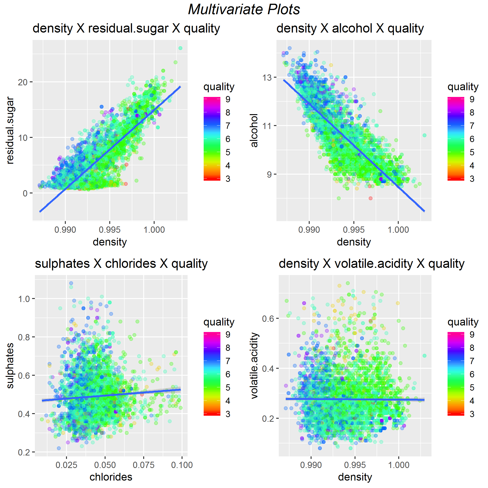

TITLE by Rodrigo P Maruyama
========================================================
# Table of contents

1. Data Structure: 
  + Size
  + Summary 

2. Univariate Plots Section
  + Histogram plot for each variable
  + Density plot for each variable
  + Quality histogram in detail
  + Quality.2 feature creation
  + Univariate analysis

3. Bivariate Plots Section
  + ggpairs plot
  + corrplot
  + Positive, Negative and Zero Correlation Table
  + Bivariate Boxplots
  + Bivariate Scatter plots with linear regression
  + Bivariate analysis

4. Multivariate Plots Section
  + Highest Correlated features plots
  + Special Scatter plot with linear regression line
  + Multivariate analysis

5. Pricipal component analysis - PCA

6. Models 
  + Random Forest model
  + Random Forest model with PCA
  + SVM
  
7. Final Plots and Summary

8. Reflection

9. Resources

```{r echo=FALSE, message=FALSE, warning=FALSE, setting the working directory}
setwd("C:/Users/maru/Documents/dsNanodegree/machine-learning-master/projects/finding_donors/dataAnalysisR/project/")
```


```{r echo=FALSE, message=FALSE, warning=FALSE, packages}
# Load all of the packages that you end up using in your analysis in this code
# chunk.

#install.packages("ggplot2", dependencies = TRUE) 
#install.packages("knitr", dependencies = TRUE)
#install.packages("dplyr", dependencies = TRUE)
#install.packages('GGally', dependencies = TRUE)
#install.packages('tidyverse', dependencies = TRUE)
#install.packages('ggthemes', dependencies = TRUE)
#install.packages('corrplot', dependencies = TRUE)
#install.packages('ggbiplot', dependencies = TRUE)
#install.packages('e1071', dependencies = TRUE)
#install.packages('rpart', dependencies = TRUE)
#install.packages('randomForest', dependencies = TRUE)
library(ggplot2)
library(knitr)
library(dplyr)
library(GGally)
library(tidyverse)
library(ggthemes)
library(gridExtra)
library(corrplot)
library(grid)
library(lattice)
library(ggbiplot)
library(e1071)
library(rpart)
library(randomForest)
```

```{r echo=FALSE, Load_the_Data}
# Load the Data
wdf <- read.csv('data/wineQualityWhites.csv')
wdf$X <- NULL
```

# Introduction

We will study a white wine dataset with 4898 observations and 12 features. One 
of then is the quality of the wine from 0 to 10, and the others are chemical 
information. You can find a summary regarding the features in the table below.

Dataset link: [here](https://archive.ics.uci.edu/ml/datasets/wine+quality)
Article link: [here](https://www.semanticscholar.org/paper/Modeling-wine-preferences-by-data-mining-from-Cortez-Cerdeira/977eda794ec436d20b22296ed5f3b4e2f72cb086) and [here](https://www.semanticscholar.org/paper/Modeling-wine-preferences-by-data-mining-from-Cortez-Cerdeira/977eda794ec436d20b22296ed5f3b4e2f72cb086)


# The Dataset Structure

## Dataset size

```{r echo=TRUE}
dim(wdf)
```

[1] 4898   12

## Summary of the Dataset:

```{r echo=FALSE}
swdf <- summary(wdf)
swdf <- data.frame(val = unclass(swdf$coefficients))
swdf <- t.data.frame(swdf)
write.csv(swdf, file = 'summary.csv')
```


| Feature              | unit                         | Min  | 1st Qu. | Median | Mean   | 2nd Qu. | Max    |
|----------------------|------------------------------|------|---------|--------|--------|---------|--------|
| fixed.acidity        | [g(tartaric acid)/dm^3]      | 3.80 | 6.30    | 6.80   | 6.86   | 7.30    | 14.20  |
| volatile.acidity     | [g(acetic acid)/dm^3]        | 0.08 | 0.21    | 0.26   | 0.28   | 0.32    | 1.10   |
| citric.acid          | [g/dm^3]                     | 0.00 | 0.27    | 0.32   | 0.33   | 0.39    | 1.66   |
| residual.sugar       | [g/dm^3]                     | 0.60 | 1.70    | 5.20   | 6.39   | 9.90    | 65.80  |
| chlorides            | [g(acetic acid)/dm^3]        | 0.01 | 0.04    | 0.04   | 0.05   | 0.05    | 0.35   |
| free.sulfur.dioxide  | [mg/dm^3]                    | 2.00 | 23.00   | 34.00  | 35.31  | 46.00   | 289.00 |
| total.sulfur.dioxide | [g/cm^3]                     | 9.00 | 108.00  | 134.00 | 138.40 | 167.00  | 440.00 |
| density              | [g/cm^3]                     | 0.99 | 0.99    | 0.99   | 0.99   | 1.00    | 1.04   |
| pH                   |                              | 2.72 | 3.09    | 3.18   | 3.19   | 3.28    | 3.82   |
| sulphates            | [g(potassium sulphate)/dm^3] | 0.22 | 0.41    | 0.47   | 0.49   | 0.55    | 1.08   |
| alcohol              | [% vol.]                     | 8.00 | 9.50    | 10.40  | 10.51  | 11.40   | 14.20  |
| quality              |                              | 3.00 | 5.00    | 6.00   | 5.88   | 6.00    | 9.00   |

# Univariate Plots Section

## Histogram for each feature

```{r echo=FALSE, Univariate_Plots}

p1 <- ggplot(aes(x=fixed.acidity), data = wdf) + 
  geom_histogram(fill='#99CCFF')
p2 <- ggplot(aes(x=volatile.acidity), data = wdf) + 
  geom_histogram(fill='#99CCFF')
p3 <- ggplot(aes(x=citric.acid), data = wdf) + 
  geom_histogram(fill='#99CCFF')
p4 <- ggplot(aes(x=residual.sugar), data = wdf) + 
  geom_histogram(fill='#99CCFF')
p5 <- ggplot(aes(x=chlorides), data = wdf) + 
  geom_histogram(fill='#99CCFF')
p6 <- ggplot(aes(x=free.sulfur.dioxide), data = wdf) + 
  geom_histogram(fill='#99CCFF')
p7 <- ggplot(aes(x=total.sulfur.dioxide), data = wdf) + 
  geom_histogram(fill='#99CCFF')
p8 <- ggplot(aes(x=density), data = wdf) + 
  geom_histogram(fill='#99CCFF')
p9 <- ggplot(aes(x=pH), data = wdf) + 
  geom_histogram(fill='#99CCFF', binwidth = 0.1)
p10 <- ggplot(aes(x=sulphates), data = wdf) + 
  geom_histogram(fill='#99CCFF')
p11 <- ggplot(aes(x=alcohol), data = wdf) + 
  geom_histogram(fill='#99CCFF', binwidth = 0.5)
p12 <- ggplot(aes(x=quality), data = wdf) + 
  geom_histogram(fill='#99CCFF', binwidth = 1)

u1 <- grid.arrange(p1, p2, p3, p4, p5, p6, p7, p8, p9, p10, p11, p12, ncol = 4)

ggsave(file = 'pictures/1_univariate.png', u1)

# Resources for this Chunk
# How to color the histograms
# https://www.r-bloggers.com/how-to-make-a-histogram-with-ggplot2/
```


Histogram for all features in the dataset. We can observe that most of the 
graphic have a normal right skeeled distribution and 

## Density plot for each feature with stat lines

```{r echo=FALSE, message=FALSE, warning=FALSE, description}

# Using a for loop for better programming practice and to save lines of code :)

feature_list <- names(wdf)
p <- list()
a <- 0
for (var in feature_list) {
  a <- a + 1

  p[[a]] <- ggplot(data = wdf, aes_string(x=var)) + 
    geom_density(fill='#99CCFF') + 
    geom_vline(aes_string(xintercept=mean(wdf[, var])), 
               color='blue', size=0.5) + 
    geom_vline(aes_string(xintercept=median(wdf[, var])), 
               color='red', size=0.5) +    
    geom_vline(aes_string(xintercept=quantile(wdf[, var], 0.25)), 
               linetype='dashed', size=0.5) +    
    geom_vline(aes_string(xintercept=quantile(wdf[, var], 0.75)), 
               linetype='dashed', size=0.5) +
    ylab(NULL)
  
}

ggsave(file = 'pictures/2_univariate.png', do.call(grid.arrange, p))

```


Figure 2. In this section we can see the mean, median, 1st quantile and 3rd quantile over each density distribution.

## Quality histogram in detail

```{r echo=FALSE, message=FALSE, warning=FALSE, description}
ggplot(data = wdf, aes(x=quality)) + geom_histogram(fill='#99CCFF', binwidth = 1) + geom_vline(aes_string(xintercept=mean(wdf$quality)), color='blue', size=0.5) + geom_vline(aes_string(xintercept=median(wdf$quality)), color='red', size=0.5) +    geom_vline(aes_string(xintercept=quantile(wdf$quality, 0.25)), linetype='dashed', size=0.5) +    geom_vline(aes_string(xintercept=quantile(wdf$quality, 0.75)), linetype='dashed', size=0.5) + ggtitle('Wine Quality Histogram')

ggsave(file = 'pictures/quality_stat.png')
```


In this figure we can see the Wine "Quality" Histogram with the Mean, Median, 1st and 3rd Quantile.

## Quality.2 feature creation

```{r echo=FALSE, message=FALSE, warning=FALSE, description}

# | classification | Criterion       |
# |----------------|-----------------|
# | Bad            | 3 > quality < 6 |
# | Normal         | quality = 6     |
# | Good           | quality > 6     |


wdf$quality.2 <- ifelse(wdf$quality < 6, 'bad', ifelse(wdf$quality == 6, 'normal', 'good'))
wdf$quality.2 <- as.factor(wdf$quality.2)

table(wdf$quality.2)

```

 Quality.2 |      
-----------|------
 bad       | 1640 
 good      | 1060 
 normal    | 2198 


```{r echo=FALSE, message=FALSE, warning=FALSE, description}

# Pie plot creation with percent legend

rating = c(1640, 1060, 2198)
percent <- round(100*rating/sum(rating), 1)
colors = c("red", "orange", "blue")
pie(rating, labels = percent, col = rainbow(length(rating)), main = 'Wine quality Pie chart distribution') +
  legend('topright', c('Bad', 'Normal', 'Good'), fill = rainbow(length(rating)))

```


# Univariate Analysis

### What is the structure of your dataset?

The White wine dataset have

### What is/are the main feature(s) of interest in your dataset?

The quality is the main feature of interest.

### What other features in the dataset do you think will help support your investigation into your feature(s) of interest?

https://winefolly.com/review/wine-characteristics/

We know from specialist that the basics characiteristics for a good wine are:

1. Sweetness
2. Acidity
3. Tannin
4. Alcohol (average glass of wine contains around 11-13% alcohol)
5. Body

With those characteristics in mind and looking into are dataset I will focus 
on the following variables:

1. quality
2. pH
3. residual.sugar
4. alcohol

Once Tannin is correlated with phenolic compounds and we don't have this variable
 in our dataset and Body is like a interpretation over the impression


### Did you create any new variables from existing variables in the dataset?

Yes, I created a new variable called quality.2 from quality as in the table below:

| classification | Criterion       |
|----------------|-----------------|
| Bad            | 3 > quality < 6 |
| Normal         | quality = 6     |
| Good           | quality > 6     |

### Of the features you investigated, were there any unusual distributions? Did you perform any operations on the data to tidy, adjust, or change the form of the data? If so, why did you do this?

No. I didn't change the original data.

# Bivariate Plots Section

## GGPAIRS plot

```{r echo=TRUE, Bivariate_Plots}

ggpairs(wdf) + theme(panel.grid.minor = element_blank(), panel.grid.major = element_blank())

```


```{r echo=FALSE, message=FALSE, warning=FALSE, description}

c <- corrplot.mixed(cor(wdf), tl.pos = "lt")

```

## CORRPLOT 


Looking at the "ggpairs" and "corrplot" plots result it is easy to have a good idea
about the correlations between the features. In the table below there is a list with a few pairs with the positive, negative and zero correlation. The positive correlation 
have 4 rows but we will discharge the number 2 because those features have similar 
properties.

|    | Positive correlation                       | correlation |
|----|--------------------------------------------|-------------|
| 1  | density x residual.sugar                   | 0.84        |
| 2  | total.sulfur.dioxide x free.sulfur.dioxide | 0.62        |
| 3  | density x total.sulfur.dioxide             | 0.53        |
| 4  | quality x alcohol                          | 0.44        |

|    | Negative correlation                       | correlation |
|----|--------------------------------------------|-------------|
| 1  | density x alcohol                          | -0.78       |
| 2  | total.sulfur.dioxide x alcohol             | -0.45       |
| 3  | alcohol x residual.sugar                   | -0.45       |

|    | Zero correlation                           | correlation |
|----|--------------------------------------------|-------------|
| 1  | quality x citric.acid                      | ~ 0         |
| 2  | sulphates x chlorides                      | ~ 0         |
| 3  | density x volatily.acidity                 | ~ 0         |

## Bivariate Boxplots

```{r echo=FALSE, message=FALSE, warning=FALSE, description}
# Removing outliers for density and residual.sugar for better visualization

# Positive correlation plots
p1 <- ggplot(data = wdf, aes(x = density, y = residual.sugar)) +
  geom_boxplot(aes(group = cut_width(quality, 1)), fill = '#99CCFF') +
  scale_y_continuous(limits = c(0, 25)) +
  ggtitle('density X residual.sugar')

p2 <- ggplot(data = wdf, aes(x = density, y = total.sulfur.dioxide)) +
  geom_boxplot(aes(group = cut_width(quality, 1)), fill = '#99CCFF') +
  ggtitle('density X total.sulfur.dioxide')

p3 <- ggplot(data = wdf, aes(x = quality, y = alcohol)) +
  geom_boxplot(aes(group = cut_width(quality, 1)), fill = '#99CCFF') +
  ggtitle('quality X alcohol')

# Negative correlation plots
p4 <- ggplot(data = wdf, aes(x = density, y = alcohol)) +
  geom_boxplot(aes(group = cut_width(quality, 1)), fill = '#99CCFF') +
  ggtitle('density X alcohol')

p5 <- ggplot(data = wdf, aes(y = total.sulfur.dioxide, x = alcohol)) +
  geom_boxplot(aes(group = cut_width(quality, 1)), fill = '#99CCFF') +
  ggtitle('total.sulfur.dioxide X alcohol')

p6 <- ggplot(data = wdf, aes(x = alcohol, y = residual.sugar)) +
  geom_boxplot(aes(group = cut_width(quality, 1)), fill = '#99CCFF') +
  scale_y_continuous(limits = c(0, 30)) +
  ggtitle('alcohol X residual.sugar')

# Zero correlation
p7 <- ggplot(data = wdf, aes(x = quality, y = citric.acid)) +
  geom_boxplot(aes(group = cut_width(quality, 1)), fill = '#99CCFF') +
  scale_y_continuous(limits = c(0, 1)) +
  ggtitle('quality X citric.acid')

p8 <- ggplot(data = wdf, aes(y = sulphates, x = chlorides)) +
  geom_boxplot(aes(group = cut_width(quality, 1)), fill = '#99CCFF') +
  ggtitle('sulphates X chlorides')

p9 <- ggplot(data = wdf, aes(x = density, y = volatile.acidity)) +
  geom_boxplot(aes(group = cut_width(quality, 1)), fill = '#99CCFF') +
  scale_y_continuous(limits = c(0, 0.9)) +
  ggtitle('density X volatile.acidity')

grid1 <- grid.arrange(p1, p2, p3, ncol = 3, top = textGrob("Bivariate Boxplots with Positive Correlation",gp=gpar(fontsize=15,font=3)))

grid2 <- grid.arrange(p4, p5, p6, ncol = 3, top = textGrob("Bivariate Boxplots with Negative Correlation",gp=gpar(fontsize=15,font=3)))

grid3 <- grid.arrange(p7, p8, p9, ncol = 3, top = textGrob("Bivariate Boxplots with Zero Correlation",gp=gpar(fontsize=15,font=3)))

ggsave(file = 'pictures/2_11_bivariate.png', grid1)
ggsave(file = 'pictures/2_12_bivariate.png', grid2)
ggsave(file = 'pictures/2_13_bivariate.png', grid3)

```


## Bivariate Scatter plots with linear regression line

```{r echo=FALSE, message=FALSE, warning=FALSE, description}
# Removing outliers for better visualization

# Solution for Warning message: "Continuous x aesthetic -- did you forget aes(group=...)? "
# https://ggplot2.tidyverse.org/reference/geom_boxplot.html

# Positive correlation plots
p1 <- ggplot(data = wdf, aes(x = density, y = residual.sugar)) +
  geom_point() +
  geom_smooth(method='lm',formula=y~x) +
  scale_x_continuous(limits = c(0.98, 1.01)) +
  scale_y_continuous(limits = c(0, 30))

p2 <- ggplot(data = wdf, aes(x = density, y = total.sulfur.dioxide)) +
  geom_point() +
  geom_smooth(method='lm',formula=y~x) +
  scale_x_continuous(limits = c(0.98, 1.01))

p3 <- ggplot(data = wdf, aes(x = quality, y = alcohol)) +
  geom_point()

# Negative correlation plots
p4 <- ggplot(data = wdf, aes(x = density, y = alcohol)) +
  geom_point() +
  geom_smooth(method='lm',formula=y~x) +
  scale_x_continuous(limits = c(0.98, 1.01))

p5 <- ggplot(data = wdf, aes(y = total.sulfur.dioxide, x = alcohol)) +
  geom_point() +
  geom_smooth(method='lm',formula=y~x) 

p6 <- ggplot(data = wdf, aes(x = alcohol, y = residual.sugar)) +
  geom_point() +
  geom_smooth(method='lm',formula=y~x) +
  scale_y_continuous(limits = c(0, 30))

# Zero correlation
p7 <- ggplot(data = wdf, aes(x = quality, y = citric.acid)) +
  geom_point()

p8 <- ggplot(data = wdf, aes(y = sulphates, x = chlorides)) +
  geom_point() +
  geom_smooth(method='lm',formula=y~x) +
  scale_x_continuous(limits = c(0, 0.2))

p9 <- ggplot(data = wdf, aes(x = density, y = volatile.acidity)) +
  geom_point() +
  geom_smooth(method='lm',formula=y~x) +
  scale_y_continuous(limits = c(0, 0.9)) +
  scale_x_continuous(limits = c(0.98, 1.01))

grid1 <- grid.arrange(p1, p2, p3, ncol = 3, top = textGrob("Bivariate Scatter plot with Positive Correlation",gp=gpar(fontsize=15,font=3)))

grid2 <- grid.arrange(p4, p5, p6, ncol = 3, top = textGrob("Bivariate Scatter plot with Negative Correlation",gp=gpar(fontsize=15,font=3)))

grid3 <- grid.arrange(p7, p8, p9, ncol = 3, top = textGrob("Bivariate Scatter plot with Zero Correlation",gp=gpar(fontsize=15,font=3)))

ggsave(file = 'pictures/4_11_bivariate.png', grid1)
ggsave(file = 'pictures/4_12_bivariate.png', grid2)
ggsave(file = 'pictures/4_13_bivariate.png', grid3)
  
```


## Bivariate Analysis

> **Tip**: As before, summarize what you found in your bivariate explorations
here. Use the questions below to guide your discussion.

### Talk about some of the relationships you observed in this part of the investigation. How did the feature(s) of interest vary with other features in the dataset?

quality x alcohol: The alcohol level for good wines have degrees between 12 and 13 and the variation for the data is very small compared with the others.

quality x ph: In this feature we can't find a correlation because all qualities have around the pH value.

quality x density: The good wines have a very small variance in his density but the difference between the others is in centesimal order.

quality x residual.sugar: Following the other features, residual.sugar have a very small variance for good wines. around 2 times.

### Did you observe any interesting relationships between the other features (not the main feature(s) of interest)?
No, I didn't.

### What was the strongest relationship you found?
 High correlations:

 0.839 : density x residual.sugar <br>
 0.616 : total.sulfur.dioxide x free.sulfur.dioxide <br>
 0.53  :  density x total.sulfur.dioxide <br>
 0.436 : quality x alcohol <br>

# Multivariate Plots Section

> **Tip**: Now it's time to put everything together. Based on what you found in
the bivariate plots section, create a few multivariate plots to investigate
more complex interactions between variables. Make sure that the plots that you
create here are justified by the plots you explored in the previous section. If
you plan on creating any mathematical models, this is the section where you
will do that.

```{r echo=FALSE, message=FALSE, warning=FALSE, Multivariate_Plots}

# Multivariate plots with Linear Regression

p1 <- ggplot(data = wdf, aes(x = density, y = residual.sugar, colour = quality)) +
  geom_point(alpha = 0.3) +
  geom_smooth(method='lm',formula=y~x) +
  scale_x_continuous(limits = c(0.98, 1.01)) +
  scale_y_continuous(limits = c(0, 30)) +
  scale_colour_gradientn(colours=rainbow(10)) +
  ggtitle('density X residual.sugar X quality')

p2 <- ggplot(data = wdf, aes(x = density, y = alcohol, colour = quality)) +
  geom_point(alpha = 0.3) +
  geom_smooth(method='lm',formula=y~x) +
  scale_x_continuous(limits = c(0.98, 1.01)) +
  scale_colour_gradientn(colours=rainbow(10)) +
  ggtitle('density X alcohol X quality')

p3 <- ggplot(data = wdf, aes(y = sulphates, x = chlorides, colour = quality)) +
  geom_point(alpha = 0.3) +
  geom_smooth(method='lm',formula=y~x) +
  scale_x_continuous(limits = c(0, 0.2)) +
  scale_colour_gradientn(colours=rainbow(10)) +
  ggtitle('sulphates X chlorides X quality')

p4 <- ggplot(data = wdf, aes(x = density, y = volatile.acidity, colour = quality)) +
  geom_point(alpha = 0.3) +
  geom_smooth(method='lm',formula=y~x) +
  scale_y_continuous(limits = c(0, 0.9)) +
  scale_x_continuous(limits = c(0.98, 1.01)) +
  scale_colour_gradientn(colours=rainbow(10)) +
  ggtitle('density X volatile.acidity X quality')


grid_multivariate <- grid.arrange(p1, p2, p3, p4, ncol = 2, top = textGrob("Multivariate Plots",gp=gpar(fontsize=15,font=3)))

ggsave(file = 'pictures/2_multivariate.png', grid_multivariate)

```



## Multivariate Analysis

### Talk about some of the relationships you observed in this part of the investigation. Were there features that strengthened each other in terms of looking at your feature(s) of interest?

As you saw in the ggpairs graph, the correlation between density and residual.sugar can be observed in the graphic above with a linear regression line over the previous one. I all of the 4 multivariate graphics we can observe a slightly clustering for good wines and other for the midle ones. This can be a case for try a clustering methods in predictions models?

### Were there any interesting or surprising interactions between features?

No.

# Machine Learning Models

## Creating Training and Test Datasets

```{r echo=FALSE, message=FALSE, warning=FALSE, description}

# Creating train and test datasets
wdf <- read.csv('data/wineQualityWhites.csv')
wdf$X <- NULL
wdf$quality <- as.factor(wdf$quality)

# Removing Outliers
wdf <- subset(wdf, wdf$density < quantile(wdf$density, 0.99) & wdf$residual.sugar < quantile(wdf$residual.sugar, 0.99))

set.seed(123)
samp <- sample(nrow(wdf), 0.4 * nrow(wdf))
train <- wdf[samp, ]
test <- wdf[-samp, ]
```

## Random Forest Model

```{r echo=FALSE, message=FALSE, warning=FALSE, description}

# Fitting the model
model <- randomForest(quality ~ . - quality, data = train)
pred <- predict(model, newdata = test)
table(pred, test$quality)
classAgreement(table(pred, test$quality))
```

pred   3   4   5   6   7   8   9
   3   0   1   0   0   0   0   0
   4   0  10  10   0   0   0   0
   5   3  59 556 213   8   1   0
   6   6  30 315 989 261  39   1
   7   0   4   4 113 243  37   1
   8   0   0   0   0   1  34   0
   9   0   0   0   0   0   0   0

$diag
[1] 0.6233413

$kappa
[1] 0.4110515

$rand
[1] 0.6294723

$crand
[1] 0.2100274

# Tuning the parameters SVM

```{r echo=FALSE, message=FALSE, warning=FALSE, description}

obj <- tune.svm(quality~., data = train, gamma = 2^(-1:1),cost = 2^(2:4))
summary(obj)
plot(obj)
```


- best parameters: <br>
 gamma cost <br>
     1   16 <br>
     
# Supported Vector Machines

```{r echo=FALSE, message=FALSE, warning=FALSE, description}

# SVM
svm.model  <- svm(quality ~ ., data = train, cost = 16, gamma = 1)
svm.pred <- predict(svm.model,test[,-12])
table(svm.pred,test[,12])
classAgreement(table(pred = svm.pred,true = test[,12]))
```

# Rpart

```{r echo=FALSE, message=FALSE, warning=FALSE, description}
#rpart
rpart.model <- rpart(quality ~ ., data = train)
rpart.pred <- predict(rpart.model, test[,-12], type = 'class')
table(rpart.pred,test[,12])
classAgreement(table(pred = rpart.pred,true = test[,12]))
```


svm.pred   3   4   5   6   7   8   9
       3   0   0   0   0   0   0   0
       4   0   6  10   4   2   0   0
       5   3  36 442 175  31   3   0
       6   5  44 247 791 176  25   1
       7   1   2  23 131 205  34   1
       8   0   0   1   8   9  33   0
       9   0   0   0   0   0   0   0

$diag:  0.6031033
$kappa: 0.3887747
$rand:  0.6288438
$crand: 0.1912697


rpart.pred   3   4   5   6   7   8   9
         3   0   0   0   0   0   0   0
         4   0   0   0   0   0   0   0
         5   1  46 387 222  26   2   0
         6   8  40 333 840 340  75   2
         7   0   2   3  47  57  18   0
         8   0   0   0   0   0   0   0
         9   0   0   0   0   0   0   0

$diag:  0.5242956
$kappa: 0.2146333
$rand:  0.5293917
$crand: 0.07682751

## Pricipal component analysis - PCA

To better understand how the features are correlated I ran a PCA algorithm and
I did the plot for the PCA Components and a graphic with Variance x Number of 
Component to decide how many Components I will use in the following models.

```{r echo=FALSE, message=FALSE, warning=FALSE, description}

# PCA
wdf.pca <- prcomp(wdf[,1:11], center = TRUE, scale. = TRUE)

# Variance plot
plot(wdf.pca, type = "l")
abline(h=0.6, v=8, col="blue")

# PCA components plots
g <- ggbiplot(wdf.pca, obs.scale = 1, var.scale = 1, ellipse = TRUE, circle = TRUE, alpha = 0.1) + scale_color_discrete(name = '') + theme(legend.direction = 'vertical', legend.position = 'right') + ggtitle('Principal component analysis - PCA')

ggsave(file = 'pictures/pca.png', g)

```


Looking at this graphic it is easy to indentify that we can run the models with
8 components.


In this graphic we can confirm some teories about the correlation between the 
variables. For example we expect negative correlation with alcohol and residual.sugar
once the alcohol needs sugar to be produced. pH and citric.acid and fixed.acidity
also need to have negative correlation once the lowest pH means very acid solution.

# New PCA Datasets  

```{r echo=FALSE, message=FALSE, warning=FALSE, description}

# New dataframe
new_wdf.pca <- data.frame(wdf.pca$x)
new_wdf.pca <- data.frame(new_wdf.pca[,1:8], quality = wdf$quality)

# Creating train and test datasets
set.seed(123)
samp <- sample(nrow(wdf), 0.8 * nrow(wdf))
train.pca <- new_wdf.pca[samp, ]
test.pca <- new_wdf.pca[-samp, ]
```

# Random Forest Model after PCA

```{r echo=FALSE, message=FALSE, warning=FALSE, description}

# Fitting the model, Predict and Accuracy
model <- randomForest(quality ~ . - quality, data = train.pca)
pred <- predict(model, newdata = test.pca)
table(pred, test.pca$quality)
classAgreement(table(pred, test.pca$quality))

```

pred   3   4   5   6   7   8   9
   3   0   0   0   0   0   0   0
   4   0   5   3   0   0   0   0
   5   1  16 190  45   5   0   0
   6   2  20 104 361  82  18   0
   7   0   0   4  21  84   5   0
   8   0   0   0   0   0  14   0
   9   0   0   0   0   0   0   0

$diag:  0.6673469
$kappa: 0.4780199
$rand:  0.6460612
$crand: 0.2600683

# Supported Vector Machines

```{r echo=FALSE, message=FALSE, warning=FALSE, description}

# SVM
svm.model  <- svm(quality ~ ., data = train.pca, cost = 10, gamma = 0.5)
svm.pred <- predict(svm.model,test.pca[,-12])
table(svm.pred,test.pca[,"quality"])
classAgreement(table(pred = svm.pred,true = test.pca[,"quality"]))
```

# Rpart

```{r echo=FALSE, message=FALSE, warning=FALSE, description}
#rpart
rpart.model <- rpart(quality ~ ., data = train.pca)
rpart.pred <- predict(rpart.model, test.pca[,-12], type = 'class')
table(rpart.pred,test.pca[,"quality"])
classAgreement(table(pred = rpart.pred,true = test.pca[,"quality"]))
```


## Results from the Models 

| Model               | Accuracy | Accuracy with PCA |
|---------------------|----------|-------------------|
| Random Forest       |  0.6233  |      0.6673       |
| SVM                 |  0.6031  |      0.6285       |
| rpart               |  0.5242  |      0.5040       |


# Final Plots and Summary

> **Tip**: You've done a lot of exploration and have built up an understanding
of the structure of and relationships between the variables in your dataset.
Here, you will select three plots from all of your previous exploration to
present here as a summary of some of your most interesting findings. Make sure
that you have refined your selected plots for good titling, axis labels (with
units), and good aesthetic choices (e.g. color, transparency). After each plot,
make sure you justify why you chose each plot by describing what it shows.

### Plot One
```{r echo=FALSE, Plot_One}

```

### Description One


### Plot Two
```{r echo=FALSE, Plot_Two}

```

### Description Two


### Plot Three
```{r echo=FALSE, Plot_Three}

```

### Description Three

------

# Reflection

The models I made didn't perform as well as I expected. The accuracy with PCA 
was a good choice to try to eliminate useless information in the dataset and we 
could see in the results some accuracy improvement. Removing the outliers we got 
a better result with and without PCA of around 3%.

# General resources 

## Handle data
Remove the column X from Dataframe:  https://stackoverflow.com/questions/6286313/remove-an-entire-column-from-a-data-frame-in-r/30620946 <br>


## Style and Markdown tools and cheatsheet

Marktable generator: https://www.tablesgenerator.com/markdown_tables <br>
markdown table formater: http://markdowntable.com/ <br>
Markdown basics: https://rmarkdown.rstudio.com/authoring_basics.html <br>
Style guide: http://adv-r.had.co.nz/Style.html <br>
Histogram colors: https://www.r-bloggers.com/how-to-make-a-histogram-with-ggplot2/ <br>

## Wine related articles
Sulfite regulation USA: https://www.ecfr.gov/cgi-bin/text-idx?c=ecfr&sid=33fc0c0194b58b6fe95208945b5c637a&rgn=div5&view=text&node=27:1.0.1.1.2&idno=27 <br>
Wine Characteristics: https://winefolly.com/review/wine-characteristics/ <br>

## GGplot, GGPAIRS, Corrplot and other Visualizations tips and tricks 
Colors in ggplot: http://www.cookbook-r.com/Graphs/Colors_(ggplot2)/ <br>
More COlors in ggplot: http://www.sthda.com/english/wiki/ggplot2-colors-how-to-change-colors-automatically-and-manually <br>
Insert a line in plot: http://www.sthda.com/english/wiki/abline-r-function-an-easy-way-to-add-straight-lines-to-a-plot-using-r-software <br>
Corrplot: https://cran.r-project.org/web/packages/corrplot/vignettes/corrplot-intro.html <br>
aes_string in the geom_vline: https://www.biostars.org/p/234142/ <br>
Pie color reference link: http://www.r-tutor.com/elementary-statistics/qualitative-data/pie-chart <br>
Legend and percent reference link: https://www.tutorialspoint.com/r/r_pie_charts.htm <br>
GGpairs: https://www.rdocumentation.org/packages/GGally/versions/1.4.0/topics/ggpairs <br>
Ggpairs with background: https://stackoverflow.com/questions/48104455/ggpairs-correlation-values-without-gridlines <br>
ggbipplot documentation: https://www.rdocumentation.org/packages/ggbiplot/versions/0.55 <br>

## PCA and Machine Learning Models
PCA: https://www.r-bloggers.com/computing-and-visualizing-pca-in-r/ <br>
Random Forest Predictor: https://datascienceplus.com/predicting-wine-quality-using-random-forests/ <br>
Random Forest + PCA: https://www.analyticsvidhya.com/blog/2016/03/practical-guide-principal-component-analysis-python/ <br> 
