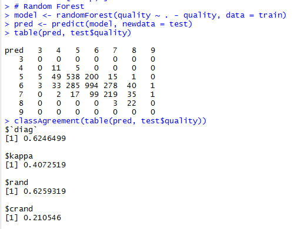
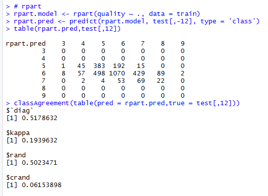
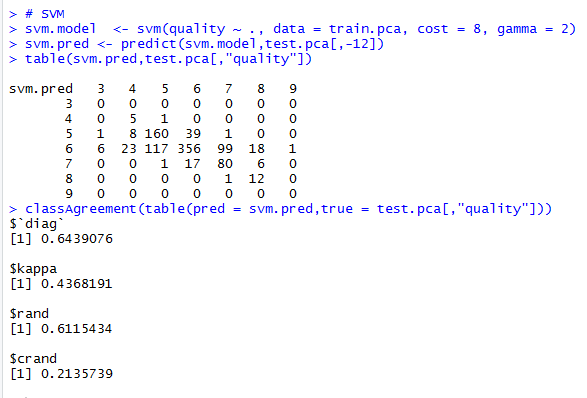
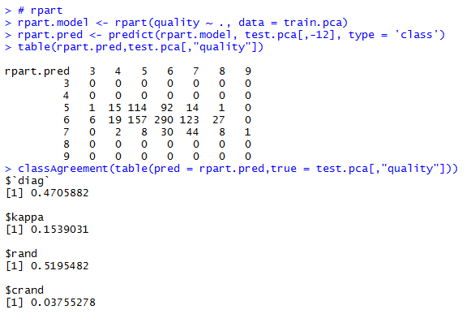

---
output:
  html_document: default
  pdf_document: default
editor_options: 
  chunk_output_type: console
---
TITLE by Rodrigo P Maruyama
========================================================
# Table of contents

1. Data Structure:
  + Size
  + Summary

2. Univariate Plots Section
  + Histogram plot for each variable
  + Density plot for each variable
  + Quality histogram in detail
  + Quality.2 feature creation
  + Univariate analysis

3. Bivariate Plots Section
  + ggpairs plot
  + corrplot
  + Positive, Negative and Zero Correlation Table
  + Bivariate Boxplots
  + Bivariate Scatter plots with linear regression
  + Bivariate analysis

4. Multivariate Plots Section
  + Highest Correlated features plots
  + Special Scatter plot with linear regression line
  + Multivariate analysis

5. Pricipal component analysis - PCA

6. Models
  + Random Forest model
  + Random Forest model with PCA
  + SVM

7. Final Plots and Summary

8. Reflection

9. Resources


```r
setwd("C:/Users/maru/Documents/finding_donors/dataAnalysisR/project/")
```


```r
library(ggfortify)
library(ggplot2)
library(knitr)
library(dplyr)
library(GGally)
library(tidyverse)
library(ggthemes)
library(gridExtra)
library(corrplot)
library(grid)
library(lattice)
library(e1071)
library(rpart)
library(randomForest)
```


```r
# Load the Data
wdf <- read.csv('data/wineQualityWhites.csv')
wdf$X <- NULL
```

# Introduction

We will study a white wine dataset with 4898 observations and 12 features. One
of then is the quality of the wine from 0 to 10, and the others are chemical
information. You can find a summary regarding the features in the table below.

Dataset link: [here](https://archive.ics.uci.edu/ml/datasets/wine+quality) <br>
Article link: [here](https://www.semanticscholar.org/paper/Modeling-wine-preferences-by-data-mining-from-Cortez-Cerdeira/977eda794ec436d20b22296ed5f3b4e2f72cb086)

# The Dataset Structure

## Dataset size


```r
dim(wdf)
```

```
## [1] 4898   12
```


## Summary of the Dataset:


```r
swdf <- summary(wdf)
swdf <- t.data.frame(swdf)
write.csv(swdf, file = 'summary.csv')
```


| Feature              | unit                         | Min  | 1st Qu. | Median | Mean   | 2nd Qu. | Max    |
|----------------------|------------------------------|------|---------|--------|--------|---------|--------|
| fixed.acidity        | [g(tartaric acid)/dm^3]      | 3.80 | 6.30    | 6.80   | 6.86   | 7.30    | 14.20  |
| volatile.acidity     | [g(acetic acid)/dm^3]        | 0.08 | 0.21    | 0.26   | 0.28   | 0.32    | 1.10   |
| citric.acid          | [g/dm^3]                     | 0.00 | 0.27    | 0.32   | 0.33   | 0.39    | 1.66   |
| residual.sugar       | [g/dm^3]                     | 0.60 | 1.70    | 5.20   | 6.39   | 9.90    | 65.80  |
| chlorides            | [g(acetic acid)/dm^3]        | 0.01 | 0.04    | 0.04   | 0.05   | 0.05    | 0.35   |
| free.sulfur.dioxide  | [mg/dm^3]                    | 2.00 | 23.00   | 34.00  | 35.31  | 46.00   | 289.00 |
| total.sulfur.dioxide | [g/cm^3]                     | 9.00 | 108.00  | 134.00 | 138.40 | 167.00  | 440.00 |
| density              | [g/cm^3]                     | 0.99 | 0.99    | 0.99   | 0.99   | 1.00    | 1.04   |
| pH                   |                              | 2.72 | 3.09    | 3.18   | 3.19   | 3.28    | 3.82   |
| sulphates            | [g(potassium sulphate)/dm^3] | 0.22 | 0.41    | 0.47   | 0.49   | 0.55    | 1.08   |
| alcohol              | [% vol.]                     | 8.00 | 9.50    | 10.40  | 10.51  | 11.40   | 14.20  |
| quality              |                              | 3.00 | 5.00    | 6.00   | 5.88   | 6.00    | 9.00   |

# Univariate Plots Section

## Histogram for each feature


Histogram for all features in the dataset. We can observe that most of the
graphic have a normal distribution with a tendency for a positive skeew. The next section we will remove the outliers based on our observation on the plots below and re-plot the Histograms again.


```r
wdf <- subset(wdf, wdf$fixed.acidity < 11)
wdf <- subset(wdf, wdf$volatile.acidity < 0.75)
wdf <- subset(wdf, wdf$citric.acid < 1)
wdf <- subset(wdf, wdf$residual.sugar < 30)
wdf <- subset(wdf, wdf$chlorides < 0.10)
wdf <- subset(wdf, wdf$free.sulfur.dioxide < 125)
wdf <- subset(wdf, wdf$total.sulfur.dioxide < 350)
wdf <- subset(wdf, wdf$density < 1.005)
```


Histograms re-ploted without outliers.

## Density plot for each feature with stat lines


In this plot and from the histograms above we can see the mean, median, 1st quantile and 3rd quantile over each density distribution and a very normal distribution for all features except for residual.sugar that have a very slightly positve skeew.

## Quality.2 feature creation


```r
# | classification | Criterion       |
# |----------------|-----------------|
# | Bad            | 3 > quality < 6 |
# | Normal         | quality = 6     |
# | Good           | quality > 6     |


wdf$quality.2 <- ifelse(wdf$quality < 6, 'bad', ifelse(wdf$quality == 6, 'normal', 'good'))
wdf$quality.2 <- as.factor(wdf$quality.2)

table(wdf$quality.2)
```

```
## 
##    bad   good normal 
##   1565   1055   2139
```

```r
wdf$quality.2 <- NULL
```

 Quality.2 | raw  dataset | outliers removed dataset
-----------|--------------|--------------------------
 bad       |     1640     |           1565
 good      |     1060     |           1055
 normal    |     2198     |           2139


```r
# Pie plot creation with percent legend

rating = as.numeric(c(1565, 2139, 1055))
percent <- round(100*rating/sum(rating), 1)
colors = c("red", "orange", "blue")
lable <- c('Bad', 'Normal', 'Good')
pie(rating, labels = lable, main = 'Wine quality Pie chart distribution', col = colors)
```


# Univariate Analysis

### What is the structure of your dataset?

See Dataset Structure above.

### What is/are the main feature(s) of interest in your dataset?

The quality is the main feature of interest.

### What other features in the dataset do you think will help support your investigation into your feature(s) of interest?

From the specialist [](https://winefolly.com/review/wine-characteristics/
) the Wine basics characiteristics are:

1. Sweetness
2. Acidity
3. Tannin
4. Alcohol
5. Body

Tannin is correlated with phenolic compounds and we don't have this variable in our dataset and Body is a mix from  all characteristics mentioned will focusing on the following variables:

1. quality
2. pH
3. residual.sugar
4. alcohol

### Did you create any new variables from existing variables in the dataset?

Yes, I created a new variable called quality.2 from quality as in the table below:

 classification |    Criterion
----------------|-----------------
 Bad            | 3 > quality < 6
 Normal         |   quality = 6
 Good           |   quality > 6

### Of the features you investigated, were there any unusual distributions? Did you perform any operations on the data to tidy, adjust, or change the form of the data? If so, why did you do this?

No. I didn't change the original data.

# Bivariate Plots Section

## GGPAIRS plot


## CORRPLOT


Looking at the "ggpairs" and "corrplot" plots result it is easy to have a good idea
about the correlations between the features. In the table below there is a list with a few pairs with the positive, negative and zero correlation. The positive correlation
have 4 rows but we will discharge the number 2 because those features have similar
properties.

|    | Positive correlation                       | correlation | correlation outliers |
|----|--------------------------------------------|-------------|----------------------|
| 1  | density x residual.sugar                   | 0.84        | 0.84                 |
| 2  | total.sulfur.dioxide x free.sulfur.dioxide | 0.62        | 0.61                 |
| 3  | density x total.sulfur.dioxide             | 0.53        | 0.55                 |
| 4  | quality x alcohol                          | 0.44        | 0.44                 |

|    | Negative correlation                       | correlation | correlation outliers  |
|----|--------------------------------------------|-------------|-----------------------|
| 1  | density x alcohol                          | -0.78       | -0.81                 |
| 2  | total.sulfur.dioxide x alcohol             | -0.45       | -0.46                 |
| 3  | alcohol x residual.sugar                   | -0.45       | -0.48                 |

|    | Zero correlation                           | correlation | correlation outliers  |
|----|--------------------------------------------|-------------|-----------------------|
| 1  | quality x citric.acid                      | ~ 0         | ~ 0                   |
| 2  | sulphates x chlorides                      | ~ 0         |  0.06                 |
| 3  | density x volatily.acidity                 | ~ 0         | -0.03                 |

## Bivariate Boxplots


## Bivariate Scatter plots with linear regression line


## Bivariate Analysis

### Talk about some of the relationships you observed in this part of the investigation. How did the feature(s) of interest vary with other features in the dataset?

- Strong Positive correlation

In the density_X_residual.sugar plot we can observe a strong correlation. The
amount of wines with lower density and residual.sugar is bigger than high values.
In density_X_total.sulfur.dioxide the plot have a eclipse format where the amount
of wines have a concentration in the midle for both features but fot total.sulfur.dioxide they are spread much more.


- Strong Negative correlation

In the density_X_alcohol plot we can see the expected behaivour once the alcohol
density is lower than the water density.
For both second and third plots they have a negative tendency nad for alcohol_X_residual.sugar they are a concentration of wines with lower residual.sugar quantities.

- Zero Correlation

Those plots we can check what was expected from the correlation value. They don't
have any strong tendency.

### Did you observe any interesting relationships between the other features (not the main feature(s) of interest)?


### What was the strongest relationship you found?

|    | Positive correlation                       | correlation | correlation outliers |
|----|--------------------------------------------|-------------|----------------------|
| 1  | density x residual.sugar                   | 0.84        | 0.84                 |
| 2  | total.sulfur.dioxide x free.sulfur.dioxide | 0.62        | 0.61                 |
| 3  | density x total.sulfur.dioxide             | 0.53        | 0.55                 |
| 4  | quality x alcohol                          | 0.44        | 0.44                 |

In this table we can see the correlation using a raw dataset and the dataset
without oultliers we can't see difference between them. We can disconsidering
total.sulfur.dioxide x free.sulfur.dioxide beacuse one is part of the others.

# Multivariate Plots Section


## Multivariate Analysis

### Talk about some of the relationships you observed in this part of the investigation. Were there features that strengthened each other in terms of looking at your feature(s) of interest?

We can confirm the correlation between density and residual.sugar in the ggpairs
 plot and linear regression line over the previous one. I all of the 4
 multivariate graphics we can observe a concentration for good wines instead
 normal and bad ones.

# Machine Learning Models

## Creating Training and Test Datasets


```r
# Creating train and test datasets
wdf <- read.csv('data/wineQualityWhites.csv')
wdf$X <- NULL
wdf$quality <- as.factor(wdf$quality)

set.seed(13)
samp <- sample(nrow(wdf), 0.4 * nrow(wdf))
train <- wdf[samp, ]
test <- wdf[-samp, ]
```

## Random Forest Model


```r
# Random Forest
model <- randomForest(quality ~ . - quality, data = train)
pred <- predict(model, newdata = test)
table(pred, test$quality)
```

```
##     
## pred    3    4    5    6    7    8    9
##    3    0    0    0    0    0    0    0
##    4    0   10    1    0    0    0    0
##    5   10   58  552  216   13    1    0
##    6    6   34  317 1008  284   42    1
##    7    0    2    7  107  222   18    2
##    8    0    0    0    1    1   26    0
##    9    0    0    0    0    0    0    0
```

```r
classAgreement(table(pred, test$quality))
```

```
## $diag
## [1] 0.6185777
## 
## $kappa
## [1] 0.3953482
## 
## $rand
## [1] 0.6163505
## 
## $crand
## [1] 0.1937039
```



# Tuning the parameters SVM


```
## 
## Parameter tuning of 'svm':
## 
## - sampling method: 10-fold cross validation 
## 
## - best parameters:
##  gamma cost
##    0.5    4
## 
## - best performance: 0.4165097 
## 
## - Detailed performance results:
##   gamma cost     error dispersion
## 1   0.5    4 0.4165097 0.04025219
## 2   1.0    4 0.4287650 0.03797280
## 3   2.0    4 0.4394976 0.03947698
## 4   0.5    8 0.4231450 0.04125171
## 5   1.0    8 0.4292752 0.03964314
## 6   2.0    8 0.4394976 0.03947698
## 7   0.5   16 0.4236525 0.04311762
## 8   1.0   16 0.4313161 0.03835629
## 9   2.0   16 0.4394976 0.03947698
```


# Supported Vector Machines


```r
# SVM
svm.model  <- svm(quality ~ ., data = train, cost = 16, gamma = 1)
svm.pred <- predict(svm.model,test[,-12])
table(svm.pred,test[,12])
```

```
##         
## svm.pred    3    4    5    6    7    8    9
##        3    0    0    0    0    0    0    0
##        4    0    7    4    3    0    0    0
##        5    1   29  429  168   17    3    0
##        6   15   68  429 1069  275   46    2
##        7    0    0   15   89  216    8    1
##        8    0    0    0    3   12   30    0
##        9    0    0    0    0    0    0    0
```

```r
classAgreement(table(pred = svm.pred,true = test[,12]))
```

```
## $diag
## [1] 0.5957809
## 
## $kappa
## [1] 0.3483179
## 
## $rand
## [1] 0.5797115
## 
## $crand
## [1] 0.1481319
```


# Rpart


```r
# rpart
rpart.model <- rpart(quality ~ ., data = train)
rpart.pred <- predict(rpart.model, test[,-12], type = 'class')
table(rpart.pred,test[,12])
```

```
##           
## rpart.pred   3   4   5   6   7   8   9
##          3   0   0   0   0   0   0   0
##          4   0   0   0   0   0   0   0
##          5   4  51 492 316  29   0   0
##          6  12  53 382 972 421  73   2
##          7   0   0   3  44  70  14   1
##          8   0   0   0   0   0   0   0
##          9   0   0   0   0   0   0   0
```

```r
classAgreement(table(pred = rpart.pred,true = test[,12]))
```

```
## $diag
## [1] 0.5219462
## 
## $kappa
## [1] 0.2113672
## 
## $rand
## [1] 0.5303407
## 
## $crand
## [1] 0.07252576
```




## Pricipal component analysis - PCA

To better understand how the features are correlated I ran a PCA algorithm and
I did the plot for the PCA Components and a graphic with Variance x Number of
Component to decide how many Components I will use in the following models.


Looking at this graphic it is easy to indentify that we can run the models with
8 components without loosing accuracy in our model.


In this graphic we can confirm some teories about the correlation between the
variables. For example we expect negative correlation with alcohol and residual.sugar
once the alcohol needs sugar to be produced. pH and citric.acid and fixed.acidity
also need to have negative correlation once the lowest pH means very acid solution.

# New PCA Datasets


```r
# New dataframe
new_wdf.pca <- data.frame(wdf.pca$x)
new_wdf.pca <- data.frame(new_wdf.pca[,1:8], quality = wdf$quality)

# Creating train and test datasets
set.seed(123)
samp <- sample(nrow(wdf), 0.8 * nrow(wdf))
train.pca <- new_wdf.pca[samp, ]
test.pca <- new_wdf.pca[-samp, ]
```

# Random Forest Model after PCA


```r
# Random Forest
model <- randomForest(quality ~ . - quality, data = train.pca)
pred <- predict(model, newdata = test.pca)
table(pred, test.pca$quality)
```

```
##     
## pred   3   4   5   6   7   8   9
##    3   0   0   0   0   0   0   0
##    4   0   5   3   0   0   0   0
##    5   1  16 190  45   5   0   0
##    6   2  20 104 361  82  18   0
##    7   0   0   4  21  84   5   0
##    8   0   0   0   0   0  14   0
##    9   0   0   0   0   0   0   0
```

```r
classAgreement(table(pred, test.pca$quality))
```

```
## $diag
## [1] 0.6673469
## 
## $kappa
## [1] 0.4780199
## 
## $rand
## [1] 0.6460612
## 
## $crand
## [1] 0.2600683
```


# Supported Vector Machines PCA


```r
# Tune parameters for new dataset
obj <- tune.svm(quality~., data = train.pca, gamma = 2^(-1:1),cost = 2^(2:4))
summary(obj)
```

```
## 
## Parameter tuning of 'svm':
## 
## - sampling method: 10-fold cross validation 
## 
## - best parameters:
##  gamma cost
##      2   16
## 
## - best performance: 0.3511933 
## 
## - Detailed performance results:
##   gamma cost     error dispersion
## 1   0.5    4 0.3892237 0.02190168
## 2   1.0    4 0.3624263 0.02604457
## 3   2.0    4 0.3519593 0.03454578
## 4   0.5    8 0.3904947 0.02398771
## 5   1.0    8 0.3519606 0.02734123
## 6   2.0    8 0.3527246 0.03608491
## 7   0.5   16 0.3833512 0.02405009
## 8   1.0   16 0.3552782 0.02570829
## 9   2.0   16 0.3511933 0.03571409
```

```r
plot(obj)
```


```r
# SVM
svm.model  <- svm(quality ~ ., data = train.pca, cost = 8, gamma = 2)
svm.pred <- predict(svm.model,test.pca[,-12])
table(svm.pred,test.pca[,"quality"])
```

```
##         
## svm.pred   3   4   5   6   7   8   9
##        3   0   0   0   0   0   0   0
##        4   0   3   0   2   0   0   0
##        5   0   7 160  45  10   1   0
##        6   3  31 131 359  82  19   0
##        7   0   0  10  20  78   4   0
##        8   0   0   0   1   1  13   0
##        9   0   0   0   0   0   0   0
```

```r
classAgreement(table(pred = svm.pred,true = test.pca[,"quality"]))
```

```
## $diag
## [1] 0.6255102
## 
## $kappa
## [1] 0.4069812
## 
## $rand
## [1] 0.6028163
## 
## $crand
## [1] 0.1885932
```



# Rpart


```r
# rpart
rpart.model <- rpart(quality ~ ., data = train.pca)
rpart.pred <- predict(rpart.model, test.pca[,-12], type = 'class')
table(rpart.pred,test.pca[,"quality"])
```

```
##           
## rpart.pred   3   4   5   6   7   8   9
##          3   0   0   0   0   0   0   0
##          4   0   0   0   0   0   0   0
##          5   1  13 148  81  16   1   0
##          6   2  28 153 346 155  36   0
##          7   0   0   0   0   0   0   0
##          8   0   0   0   0   0   0   0
##          9   0   0   0   0   0   0   0
```

```r
classAgreement(table(pred = rpart.pred,true = test.pca[,"quality"]))
```

```
## $diag
## [1] 0.5040816
## 
## $kappa
## [1] 0.1712546
## 
## $rand
## [1] 0.4840862
## 
## $crand
## [1] 0.04486528
```



## Results from the Models

| Model               | Accuracy | Accuracy with PCA |
|---------------------|----------|-------------------|
| Random Forest       |  0.6232  |      0.6680       |
| SVM                 |  0.5900  |      0.6439       |
| rpart               |  0.5157  |      0.4705       |


# Final Plots and Summary

### Plot One


### Description One


### Plot Two


### Description Two


### Plot Three


### Description Three

------

# Reflection

The models I made didn't perform as well as I expected. The accuracy with PCA
was a good choice to try to eliminate useless information in the dataset and we
could see in the results some accuracy improvement. Removing the outliers we got
a better result with and without PCA of around 3%.

# General resources

## Articles

- Modeling wine preferences by data mining from physicochemical properties by Paulo Cortez,Ant?nio Cerdeira, Fernando Almeida, Telmo Matos, Jos? Reis. (2009) 547-553 <br>
- Support Vector Machines, The Interface to libsvm in package e1071 by David Meyer <br>
- A Practical Guide to Support Vector Classification by Chih-Wei Hsu, Chih-Chung Chang, and Chih-Jen Lin (2016)

## Handle data
Remove the column X from Dataframe:  https://stackoverflow.com/questions/6286313/remove-an-entire-column-from-a-data-frame-in-r/30620946 <br>


## Style and Markdown tools and cheatsheet

Marktable generator: https://www.tablesgenerator.com/markdown_tables <br>
markdown table formater: http://markdowntable.com/ <br>
Markdown basics: https://rmarkdown.rstudio.com/authoring_basics.html <br>
Style guide: http://adv-r.had.co.nz/Style.html <br>
Histogram colors: https://www.r-bloggers.com/how-to-make-a-histogram-with-ggplot2/ <br>

## Wine related articles
Sulfite regulation USA: https://www.ecfr.gov/cgi-bin/text-idx?c=ecfr&sid=33fc0c0194b58b6fe95208945b5c637a&rgn=div5&view=text&node=27:1.0.1.1.2&idno=27 <br>
Wine Characteristics: https://winefolly.com/review/wine-characteristics/ <br>

## GGplot, GGPAIRS, Corrplot and other Visualizations tips and tricks
Colors in ggplot: http://www.cookbook-r.com/Graphs/Colors_(ggplot2)/ <br>
More COlors in ggplot: http://www.sthda.com/english/wiki/ggplot2-colors-how-to-change-colors-automatically-and-manually <br>
Insert a line in plot: http://www.sthda.com/english/wiki/abline-r-function-an-easy-way-to-add-straight-lines-to-a-plot-using-r-software <br>
Corrplot: https://cran.r-project.org/web/packages/corrplot/vignettes/corrplot-intro.html <br>
aes_string in the geom_vline: https://www.biostars.org/p/234142/ <br>
Pie color reference link: http://www.r-tutor.com/elementary-statistics/qualitative-data/pie-chart <br>
Legend and percent reference link: https://www.tutorialspoint.com/r/r_pie_charts.htm <br>
GGpairs: https://www.rdocumentation.org/packages/GGally/versions/1.4.0/topics/ggpairs <br>
Ggpairs with background: https://stackoverflow.com/questions/48104455/ggpairs-correlation-values-without-gridlines <br>
ggbipplot documentation: https://www.rdocumentation.org/packages/ggbiplot/versions/0.55 <br>

## PCA and Machine Learning Models
PCA: https://www.r-bloggers.com/computing-and-visualizing-pca-in-r/ <br>
Random Forest Predictor: https://datascienceplus.com/predicting-wine-quality-using-random-forests/ <br>
Random Forest + PCA: https://www.analyticsvidhya.com/blog/2016/03/practical-guide-principal-component-analysis-python/ <br>
